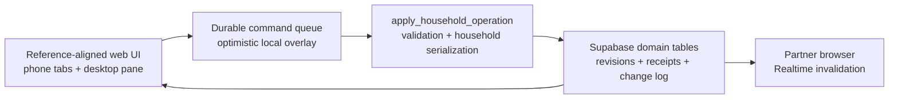
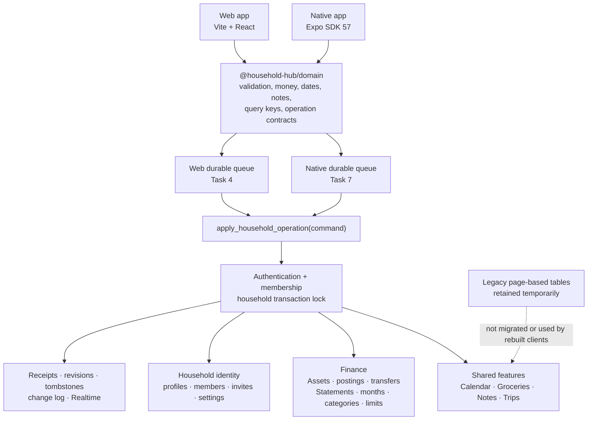
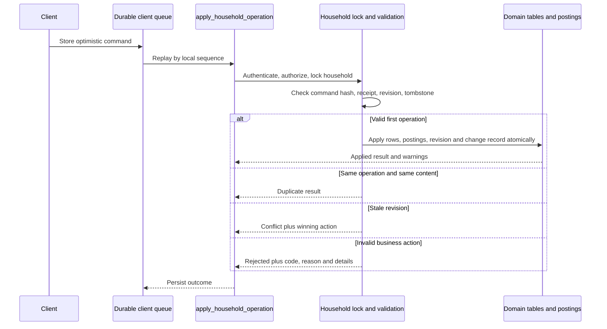
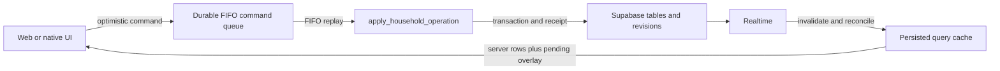

# Household Hub Mobile-First — Implementation Detail (archive)

Full per-task narratives, architecture diagrams, verification baselines, and
reviews for Tasks 1-4, plus the original task scope. The concise resume state
lives in `progress.md`; this file is the deep record, not required to continue.

---

## 2026-07-25 web parity correction acceptance

The correction pass is complete across Calendar, Groceries, Ledger, Notes, and
Trips. It closes the user-reported workflow gaps without changing the shared
server-authoritative architecture.



### Accepted feature behavior

| Area | Accepted result |
| --- | --- |
| Calendar | Timed/all-day payload branches, reminder adapter, and final rejection handling work through the real RPC |
| Groceries | Inline list rename, household autocomplete, purchase dates, checked-newest-first ordering, and five cheapest historical prices |
| Ledger | List-first years, annual and monthly charts, 12-month details, default income categories, separate income/spending flows, and atomic Asset postings |
| Notes | Semantic read mode; one explicit title-and-document draft with Save/Cancel; restricted shared JSON |
| Trips | Manual ISO destination currency, matching-Asset selection, separate CAD/foreign totals, and CAD-only Travel Ledger linkage |

The correction commits are:

- `b7a33b7 fix: align Calendar operation contract`
- `876d532 feat: restore Grocery parity workflows`
- `9523b77 feat: complete Ledger statement workflows`
- `bfd8d5d feat: add Notes read and explicit edit modes`
- `2b18d9e feat: clarify Trip currency expense flow`
- `docs: complete web parity correction handoff` (final acceptance commit)

### Database changes and live evidence

- `20260725016000_grocery_purchase_dates.sql` adds server-owned Grocery
  `checked_at` lifecycle behavior.
- `20260725017000_ledger_default_income_categories.sql` creates and backfills
  Salary, Bonus, RRSP, TFSA, ESPP, and Government benefit for all 12 months.
- A loopback-only reset replayed the full migration chain. Database verification
  passed **313 tests across 5 files**, and Supabase lint reported no schema
  errors.
- The two-member `🐰 & 🐧 Test` household was recreated through onboarding and
  invite redemption, then populated with **26 real operation RPC commands**.
- The retained dataset exposes every corrected screen: Calendar event, two
  Grocery lists and price history, CAD/GBP Assets, 2026 Ledger activity,
  auto-linked 2027 Travel spending, a checklist Note, and London Trip totals of
  CAD `$5,309.00` plus GBP `£2,409.00`.

Local test credentials:

| Member | Email | Password | Role |
| --- | --- | --- | --- |
| Yongju | `yongju@test.local` | `household123` | Owner |
| Claire | `claire@test.local` | `household123` | Member |

### Browser and regression evidence

- Authenticated system-Chrome review at **402×874** and **1440×1000** covered
  Calendar, Grocery list/detail, Ledger annual/month detail, Notes read view,
  and Trip detail.
- 24 screenshots are retained outside Git under
  `/tmp/household-hub-web-parity/`; no generated artifact was added to the
  repository.
- The review found zero page errors and zero console errors.
- Recharts animation was disabled for statement donuts to make initial paint
  complete and deterministic.
- Final web suite: **70 files, 398 tests passed**; ESLint, TypeScript,
  production Vite/PWA build, and `git diff --check` passed.
- Edge Function tests: **73 passed**.
- Queue tests cover offline and reconnect replay, duplicates, stale conflicts,
  permanent discard explanations, two-device ordering, local overlays, and
  Realtime reconciliation.

### Explicit residuals and resume gate

- The existing production-build large-chunk warning is accepted and
  non-blocking.
- Trip Itinerary, Bookings, and Checklist require new mobile-first tables and
  operation types. Those tabs retain an explicit coming-soon state; Expenses is
  complete.
- No hosted environment was changed, no production reset was run, and no
  native/physical-device verification is claimed.
- Task 7 (Expo foundation) is the next task, but must not begin until the user
  accepts this web checkpoint.

---

## Architecture after Tasks 1 and 2



### Authoritative operation lifecycle



## Task 1 — Shared foundation and domain contracts

### Delivered

Created the internal pure-TypeScript package:

```text
packages/domain/
├── src/calendar.ts
├── src/money.ts
├── src/notes.ts
├── src/operations.ts
├── src/queryKeys.ts
├── src/trips.ts
├── src/validation.ts
└── src/index.ts
```

It is consumed by both the root Vite application and the Expo package.
TypeScript, Vite, npm workspace, and Metro resolution were updated without
placing React UI in the shared package.

### Shared validation

- UUID identifiers
- Safe integer cents, including signed and positive schemas
- Explicit ISO 4217 currency validation
- IANA timezone validation
- Strict ISO dates and datetimes, including rejection of normalized impossible
  dates such as February 30
- Mutable revisions beginning at 1
- Local sequence and operation-envelope validation

### Money, Calendar, and Trips

- Currency-aware cents formatting
- No currency conversion
- Timed Calendar events use UTC instants and a source timezone
- All-day Calendar events preserve fixed dates
- Trip totals aggregate into separate currency buckets

### Notes contract

The shared rich-note JSON validator accepts only:

- document
- paragraph
- text
- hard break
- Heading 1–3
- bullet list
- numbered list
- checklist
- list item
- checklist item with a Boolean checked value

Images, links, unsupported marks, arbitrary attributes, and invalid nested
content are rejected.

### Durable operation contract

Commands include:

- schema version
- operation ID
- device ID
- local sequence
- household ID
- allowlisted operation type
- entity type and entity ID
- base revision
- enqueue timestamp
- strict payload

Results form a discriminated union:

- `applied`: server sequence, resulting revision, optional details/warnings
- `duplicate`: original server sequence
- `conflict`: current revision and winning operation/entity details
- `rejected`: stable code, reason, structured details, and warnings

### Task 1 commits

- `d49035d feat: add shared domain contracts`
- `ffc3c01 fix: tighten domain contract validation`

### Task 1 review

The first review found seven important gaps:

1. The Expo package depended on untracked entry/config files.
2. Required Ledger/transfer/schedule operation families were absent.
3. Conflict results did not require winner details.
4. Currency validation accepted non-ISO three-letter strings.
5. Calendar accepted impossible normalized dates.
6. Notes accepted invalid fields on node types.
7. The Notes document type disagreed with runtime validation.

All seven were fixed. The scoped re-review approved Task 1 with no new
Critical or Important issues.

## Task 2 — Mobile-first Supabase schema and authoritative RPC

### Ordered migrations

- `supabase/migrations/20260725010000_mobile_first_schema.sql`
- `supabase/migrations/20260725011000_household_operation_rpc.sql`
- `supabase/migrations/20260725012000_mobile_first_security_realtime.sql`

These migrations retain the legacy page-based schema but add the mobile-first
model beside it.

### Identity and household schema

- Existing households now carry an owner.
- Profiles store global display identity.
- Household members are restricted to one active household per auth user.
- Household invites store only token hashes and support expiry, revocation,
  and redemption state.
- Household user settings store appearance and notification preferences.
- The maximum-two-member behavior is supported for the onboarding/admin
  operations implemented in Task 3.

### Assets

- `ledger_assets`
- immutable `asset_postings`
- `ledger_transfers`
- `ledger_transfer_schedules`
- idempotent schedule occurrences
- a security-invoker balance view derived from postings

Asset balances are not maintained as independently mutable totals. Income,
spending, transfers, and Trip expenses produce immutable posting effects.

### Ledger

- Statement years
- exactly twelve month rows per created year
- stable category identities
- month-specific category configuration
- nullable monthly spending limits
- income and spending transactions
- default income category support
- unbudgeted Travel category support

Category and limit changes propagate from the selected month through December.
Earlier months remain unchanged.

Category deletion is rejected when spending exists in the selected or any
later affected month. The structured rejection identifies blocking months.

### Calendar

The existing Calendar table is extended rather than replaced:

- UTC timed boundaries
- IANA event timezone
- date-fixed all-day boundaries
- revision values
- multiple reminder presets

Existing Calendar rows are backfilled into the entity-revision registry so
they can immediately participate in queued mutation conflict handling.

### Groceries, Notes, Trips, and Notifications

- Standalone grocery lists, items, and immutable price history
- Multiple named Notes with restricted JSON documents
- Standalone Trips with destination timezone
- Itinerary, bookings, checklist, and expenses
- Notification inbox records and device-facing metadata

### Operation infrastructure

- per-household server sequence state
- idempotent operation receipts
- entity revision registry
- tombstones
- household change log
- safe Realtime publication metadata

### `apply_household_operation`

The security-definer RPC:

1. Validates authentication and household membership.
2. Locks the household row to serialize operations.
3. Rechecks and locks membership under the household lock.
4. Rejects oversized, malformed, or extra-key payloads.
5. Uses a fixed allowlisted dispatch; no dynamic SQL.
6. Hashes canonical command content.
7. Returns `duplicate` for an identical operation replay.
8. Rejects operation-ID reuse with different content.
9. Checks base revision and tombstone state.
10. Applies domain rows, financial postings, revision, receipt, and change log
    atomically.
11. Returns structured negative-balance warnings.

### Financial invariants

- Ledger income uses a positive Asset posting.
- Ledger spending uses a negative Asset posting.
- Edits append reversals/deltas rather than rewriting posting history.
- Deletes reverse their financial effect.
- Negative balances are allowed but reported.
- Transfers require distinct Assets in the same currency.
- Transfer edits/deletes warn about any source, new destination, or old
  destination driven below zero.
- Asset currency cannot change while referenced by a posting, transaction,
  transfer, schedule, or Trip expense.
- Recurring transfers have no income/spending effect.

### Trip expense behavior

CAD expense:

- creates the Statement year and all twelve months when absent
- creates or repairs the system Travel category
- leaves Travel unbudgeted when no explicit limit exists
- creates one linked Ledger spending transaction
- uses that Ledger posting as the Asset debit, avoiding double debit

Foreign expense:

- requires an Asset matching the Trip destination currency
- creates one foreign Asset debit
- creates no CAD Ledger transaction
- performs no conversion

Trip totals therefore remain separate, for example:

```text
CAD $5,309
GBP £2,409
```

### Typed-year clear

`ledger.year.clear` requires the exact year confirmation and removes only the
selected Statement year’s Ledger data.

When CAD Trip expenses are linked to that year:

- the Trip expenses remain
- their Ledger links are detached
- their Asset effects are converted to Trip-origin postings
- Asset balances remain accurate
- ordinary Ledger postings are reversed

### Revision and conflict integrity

Indirect parent operations also maintain child revision streams:

- deleting/editing Trip expenses tombstones generated Ledger children
- deleting a year advances or tombstones affected child entities
- partial category deletion advances category/limit child revisions
- Travel restoration preserves stable identities and invalidates stale queued
  operations
- limit identity cannot be replaced by a competing null-base operation

### Security

- Members can read only their household’s rows through RLS.
- New mutable tables deny direct authenticated writes.
- Existing `households` and `household_members` explicitly revoke
  `INSERT`, `UPDATE`, `DELETE`, and `TRUNCATE`.
- Helper functions revoke execution from `PUBLIC`, `anon`, and
  `authenticated`.
- Only the public operation RPC is granted to authenticated users.
- Security-definer functions use an explicit safe search path.
- Realtime publishes user-facing tables/change metadata, not private receipt
  or device command data.

### Task 2 commits

- `f732c1d feat: add mobile-first household schema`
- `5c3f5cd feat: add authoritative household operation RPC`
- `6d4a122 test: secure mobile-first database operations`
- `ad62d8e fix: close mobile operation security gaps`
- `d1f3e30 fix: harden mobile operation invariants`

### Task 2 review

The official review found eight Important issues:

1. Existing Calendar rows were outside the revision system.
2. Trip-generated Ledger children could be recreated by stale commands.
3. Asset/Trip currency changes could invalidate dependent records.
4. Transfer deletion could omit a negative-balance warning.
5. Partial Travel deletion could break later CAD Trip expenses.
6. Competing limit IDs could bypass revision conflicts.
7. Global profiles could receive multiple household revision streams.
8. Extended tenancy tables retained explicit DML grants.

The fix round added regression coverage and corrected all eight. Additional
review during the fix found and corrected:

- partial category/Travel repair child revision gaps
- stale category/limit operations after parent mutations
- transfer-edit warnings for the previous destination Asset
- real pre-migration Calendar upgrade behavior

The official scoped re-review marked every original finding addressed and
found no new Critical or Important breakage.

## Current verification baseline

Freshly verified at `d1f3e30`:

| Verification | Result |
| --- | --- |
| `supabase db reset --local` | Passed |
| Main operation pgTAP suite | 89/89 passed |
| Review regression pgTAP suite | 81/81 passed |
| Pre-migration Calendar upgrade harness | 81/81 passed, no skips |
| `supabase db lint --local --schema public --level warning --fail-on error` | No errors |
| `npm test -- --run` | 34 files, 216/216 passed |
| `npm run lint` | Passed |
| `npm run build` | Passed |
| `git diff --check ffc3c01..d1f3e30` | Passed |

Expected existing warnings:

- Supabase reports the old `[inbucket]` local config section as deprecated.
- Node prints the existing experimental `localStorage` warning during Vitest.
- Vite reports an existing main-bundle chunk larger than 500 kB.
- Dependency audits currently report existing package vulnerabilities; no
  broad dependency upgrade was performed in Tasks 1 or 2.

## Known constraints and release risks

1. **No remote changes:** all database verification used local Supabase. No
   production or hosted Supabase project was changed.
2. **No data reset:** the production clear procedure is Task 9 and requires
   explicit release-time approval.
3. **Migration deployment:** the three Task 2 migrations are new and have not
   been deployed remotely. If an environment somehow records an earlier
   intermediate version, create later corrective migrations instead of
   relying on edits to an applied migration.
4. **Legacy membership preflight:** the one-user/one-household unique
   constraint will deliberately fail if legacy data has a user in multiple
   households. Run a duplicate-membership query and resolve any rows before
   hosted deployment.
5. **Future household rejoin:** leaving/rejoining another household needs an
   explicit profile-revision reset or migration strategy.
6. **Concurrent-session test:** household locking is implemented and sequence
   behavior is tested, but a true two-simultaneous-session race test remains
   for Task 9.
7. **Live Realtime:** publication and replica-identity metadata are verified;
   live two-client websocket delivery remains for Task 9.

## Task 3 — In progress

Being executed in ordered sub-checkpoints (commit + verify after each) because
Task 3 is large; this keeps progress durable across sessions.

### Done: 3A domain contracts (`47f1763`)

Added the household-administration domain layer in `@household-hub/domain`:

- `packages/domain/src/households.ts` — `householdAdminActions` allowlist
  (`household.onboard`, `invite.create|revoke|redeem`, `ownership.transfer`,
  `member.remove`, `account.delete`, `household.delete`) with strict
  per-action payload validation (exact key set + per-field validators, extra
  keys rejected); `MAX_HOUSEHOLD_MEMBERS = 2`, `INVITE_TTL_DAYS = 7`,
  `READ_NOTIFICATION_TTL_DAYS = 90`; `HouseholdAdminResult` ok/rejected guard.
- Admin actions are modeled **separately from `operationTypes`** — they are
  synchronous, online-only, and executed by security-definer RPCs / service-
  role Edge Functions, not queued through the durable operation queue.
- `packages/domain/src/calendar.ts` — `reminderPresets`
  (`none|at-time|10m|1h|1d|1w`), `isReminderPreset`, and `reminderLeadMinutes`.
- Tests: `households.test.ts` (+8), reminder cases in `calendar.test.ts` (+2).

Verified under arm64 node: `npx vitest run` 35 files / 226 passed;
`npm run lint` clean; `npm run build` clean.

### Done: 3A DB (`f283ad3`)

`supabase/migrations/20260725013000_household_admin_operations.sql` — seven
security-definer RPCs: `onboard_household`, `create_household_invite`,
`revoke_household_invite`, `redeem_household_invite`,
`transfer_household_ownership`, `remove_household_member`, `delete_household`.
Each takes the actor from `auth.uid()`, derives the household from the actor's
own membership (no household_id parameter → no IDOR), serializes under the
household `FOR UPDATE` lock, enforces the two-member cap, and returns the
shared HouseholdAdminResult shape via a private `mobile_admin_rejected` helper.
Invites store only a sha256 hash of a 32-byte url-safe token; creating a new
invite supersedes the prior active one. Direct client DML stays revoked; only
these seven functions are granted to `authenticated`. **Account deletion
(auth.users removal + created_by reconciliation) is deferred to the 3C Edge
Function.** Tests: `supabase/tests/20260725_household_admin.test.sql` (33
pgTAP assertions). Verified: `supabase db reset --local` clean; `supabase test
db --local` 3 files / **203 tests pass**; `supabase db lint` no errors.

### Done: 3B auth code (`e173e07`)

Shared auth policy in `@household-hub/domain` (`auth.ts`): `oauthProviders`
(`google`, `apple`) + guard, and `isPasswordAuthAllowed` requiring BOTH
non-production AND the test-auth flag (production is OAuth-only, cannot expose
the password path). Web helpers (`src/lib/auth.ts`): `signInWithOAuth`
(redirect `/auth/callback`) and a guarded `signInWithTestPassword`. Verified:
`npx vitest run` 36 files / **228 tests pass**; lint + build clean.
**Deferred to 3D:** `config.toml` external-provider wiring + `.env` templates
(kept with the other config changes so local `db reset`/`start` stays stable).

### Done: 3C DB layer (`1231941`)

`supabase/migrations/20260725014000_notifications_devices_and_jobs.sql`:

- **Tables** — `notification_devices` (Expo token per user+install, platform,
  `disabled_at`, `failure_count`), `calendar_reminder_dispatches` (unique on
  `(event_id, preset, occurrence_start)` → re-timing an event re-fires its
  reminder; a retried scheduler run does not), `notification_push_deliveries`
  (unique on `(notification_id, device_row_id)`). Client DML revoked; only
  `notification_devices` is client-readable (own rows), the two job ledgers are
  not readable at all.
- **Partner-only Calendar activity** — trigger on `household_change_log`
  (written last in `apply_household_operation`, after the receipt, so the actor
  is available). Kinds `calendar.event.created|updated|deleted`, recipients =
  members other than the actor. Deleted events carry `title: null` (the row is
  already gone) but keep `entityId` for the deep link.
- **Authenticated RPCs** — `register_notification_device` (reclaims a token
  Expo reissued to another install so delivery can't strand on a stale row),
  `unregister_notification_device`, `update_user_settings` (appearance +
  notifications_enabled; profile DML stays revoked).
- **Service-role job contract** — `job_calendar_reminder_candidates`,
  `job_record_calendar_reminder` (reminders go to *every* member, unlike
  activity), `job_pending_push_notifications` (skips opted-out recipients,
  disabled devices, and already-delivered pairs), `job_record_push_delivery`,
  `job_disable_notification_device`, `job_active_transfer_schedules`,
  `job_execute_transfer_occurrence` (balanced postings mirroring
  `ledger.transfer.upsert` legs; idempotent on `(schedule_id,
  occurrence_date)`; negative-balance warning without blocking),
  `job_cleanup_read_notifications`, `admin_prepare_account_deletion`.
- **Account deletion** — owner+partner → `must_transfer_ownership`; sole owner
  → household deleted with the account; non-owner → leaves and their authored
  rows are reassigned to the owner via `mobile_reassign_authorship` (every
  `created_by`/`recorded_by` is ON DELETE RESTRICT, legacy page tables
  included, so `auth.users` deletion is otherwise blocked). The Edge Function
  removes the `auth.users` row afterwards.
- **Removed-member cleanup** — trigger on `household_members` delete drops that
  user's devices and inbox rows for the household.

Verified: `supabase db reset --local` clean; `supabase test db --local`
4 files / **292 tests pass** (89 new); `supabase db lint` no errors.

### Done: 3C Edge Functions (`df02de6`)

`supabase/functions/` — five functions plus tested pure modules:

- **`_shared/timezone.ts`** — `Intl`-based offset resolution (Temporal is not
  on the edge runtime). Fall-back wall times resolve to the *earlier* instant;
  spring-forward gap times resolve to the transition instant itself (found by
  a minute-granularity binary search), so a 02:30 anchor on a spring-forward
  day still runs, at 03:00 local.
- **`_shared/reminders.ts`** — all-day events anchor to 09:00 in the event
  timezone while the dispatch key stays the event's own start (so re-timing an
  event re-fires, a retried run does not); `none`/unknown presets never fire;
  reminders past the 60-minute grace window are dropped instead of delivered
  late; candidate window = grace back, longest lead + 1 day forward.
- **`_shared/schedules.ts`** — occurrence enumeration for the four
  frequencies in the schedule's own timezone (wall-clock preserved across
  DST). Monthly re-derives from the anchor day so a February clamp doesn't
  drag later months; semi-monthly pairs the anchor day with one 15 days away;
  a run materializes at most 24 occurrences so an outage catches up in
  bounded batches.
- **`_shared/expo.ts`** — one message per (notification, enabled device),
  malformed tokens dropped, 100-message batches, positional ticket matching;
  a short/missing ticket becomes `MissingTicket` rather than a silent drop,
  and `DeviceNotRegistered` marks the device for disabling.
- **`_shared/http.ts` / `_shared/supabase.ts` / `_shared/json.ts`** — CORS,
  method/body guards, constant-time service-role check, and a dependency-free
  PostgREST/Auth client (no SDK bundle runs with the service-role key, and
  `deno check`/`deno test` work offline).
- **`household-admin`** — one audited entry point for every administration
  action. Strict `{action, payload}` validation mirroring the domain contract;
  RPC actions run as the *caller* (RLS and `auth.uid()` still apply); the
  typed household name is verified against the stored name server-side; account
  deletion runs `admin_prepare_account_deletion` first and only removes the
  `auth.users` row when the database accepted, so a rejection leaves the
  account intact.
- **`calendar-reminder-scheduler`**, **`push-dispatch`**,
  **`recurring-transfer-executor`**, **`notification-cleanup`** — service-role
  only. Push deliveries are recorded per (notification, device); a transport
  failure records nothing so the next run retries, while an Expo-reported
  error is recorded as permanent (the inbox row remains the durable record).

Also: `npm run test:functions` (`deno test supabase/functions/`),
`src/test/edgeFunctionParity.test.ts` (asserts the edge copies of the reminder
presets, admin actions, name/code validation, and the 90-day TTL still match
`@household-hub/domain`), and a Vitest `exclude` for `supabase/**` so Vitest
no longer tries to load the Deno tests.

Verified: `deno test supabase/functions/` **73 passed**; `npx vitest run` 37
files / **233 passed**; `npm run lint` clean; `npm run build` clean;
`deno check` clean.

### Done: 3D config and deployment (`24a5b39`)

- **`supabase/config.toml`** — `[functions.*]` for all five functions with
  `verify_jwt = true`; `[auth.external.google]` beside Apple (both disabled
  locally unless the client id/secret are exported); web `/auth/callback` and
  native `householdhub://auth/callback` redirect URLs; `site_url` corrected to
  the Vite dev port.
- **Env templates** — `.env.example` and `mobile/.env.example` name every
  variable (web, Expo, seed script, local provider secrets, function secrets)
  with none of their values.
- **Seed fixtures** — `scripts/seed-household.ts` now provisions through the
  real path (`onboard_household` → `create_household_invite` →
  `redeem_household_invite`) instead of writing `households`/
  `household_members` directly, so seeded rows carry owner role, profiles, and
  invite redemption state. Still idempotent (membership check is scoped to the
  partner's own row — a member can read both).
- **`src/types/database.ts`** — regenerated from the local stack. This
  surfaced that the pre-rebuild Calendar screen assumed non-null
  `start_at`/`end_at`, which Task 2 widened; it now goes through
  `toLegacyCalendarEvent` (all-day rows are filtered out of that screen) until
  Task 6 replaces it.
- **`vercel.json`** — SPA rewrite plus cache headers: hashed `/assets`
  immutable for a year; `index.html`, `sw.js`, and the web manifest must
  revalidate.
- **Expo** — `mobile/app.json` carries the release identity (`householdhub`
  scheme, `com.conlegs.householdhub`, portrait, `supportsTablet: false`,
  `POST_NOTIFICATIONS`); `mobile/eas.json` defines development/preview/
  production profiles. `app.json`, `.gitignore`, and `assets/` were previously
  untracked and are now committed (the remaining Task 1 review gap).
  `expo-notifications` and its config plugin arrive in Task 7, so no plugin
  block is declared yet.
- **`docs/deployment/mobile-first-rollout.md`** — env matrix, migration
  preflight, OAuth setup, function deploy + cron cadences, Vercel, EAS, and
  seeding. No provider secrets.

#### Defect found by end-to-end verification (fixed)

Running the real functions against the local stack showed a partner could
**never delete their account**: `admin_prepare_account_deletion` accepted, then
removing the `auth.users` row failed because
`household_invites.redeemed_by` used `ON DELETE SET NULL` while the table
requires `redeemed_at`/`redeemed_by` to be null or non-null together.
`supabase/migrations/20260725015000_invite_redeemer_deletion.sql` cascades the
spent invite with its redeemer;
`supabase/tests/20260725_invite_redeemer_deletion.test.sql` (9 assertions)
fails against the old constraint and passes with the new one.

## Task 3 — complete

### Task 3 verification baseline (at `24a5b39`)

| Verification | Result |
| --- | --- |
| `supabase db reset --local` | Passed |
| `supabase test db --local` | 5 files, **301/301 passed** |
| `supabase db lint --local --schema public --level warning --fail-on error` | No errors |
| `npm run test:functions` (Deno) | **73/73 passed** |
| `npx vitest run` | 37 files, **233/233 passed** |
| `npm run lint` | Passed |
| `npm run build` | Passed |
| `supabase gen types typescript --local` | Matches the committed file |

Live end-to-end against the local stack (`supabase functions serve`, all five
functions booted):

- job functions reject an anon key (`forbidden`) and accept the service role;
- `notification-cleanup` rejects `ttlDays: 0`, runs with the default 90;
- `household-admin` rejects unauthenticated calls, unknown actions, non-POST
  verbs, and a mistyped household name (reporting the expected name);
- a seeded partner deleted their own account (authorship reassigned to the
  owner, household intact), the owner then created an invite, and finally
  deleted their own account, taking the household with it.

### Known Task 3 risks carried forward

1. **Permanently failing push batch** — a batch Expo never accepts records no
   delivery row (so it retries), which means a message Expo rejects at the
   transport level retries on every run. Bounded by the 100-notification page,
   but worth an attempt cap if it is ever observed.
2. **No independent review agent was run** for Task 3. The session directive
   is not to dispatch subagents, so this was a self-review plus the live
   end-to-end run above. `/code-review` on this branch remains available and
   is the recommended follow-up.
3. **Nothing deployed remotely.** All verification is local; no hosted
   Supabase project, Vercel deployment, or EAS build was touched.
4. **Expo push not exercised against Expo's servers** — batching and ticket
   handling are unit-tested; real delivery needs the Task 7 development build.

## Task 4 — Durable web operation queue (complete)

### Done: queue core (`dba54b5`)

`src/lib/operations/` — the rebuilt clients' only write path.

- **`types.ts`** — `QueuedOperation` (command, device id, local FIFO sequence,
  optimistic state, attempts, last error) and `DiscardedOperation` (the losing
  command, the winner, code/reason/details, acknowledgement).
- **`device.ts`** — device id persisted in IndexedDB (a new id every session would
  restart the server's per-device ordering mid-stream); local sequence
  allocated inside a transaction so concurrent enqueues cannot collide.
- **`queue.ts`** — durable-first enqueue (stored before any network attempt),
  then a FIFO replay against `apply_household_operation`:
  - `applied` / `duplicate` → leave the queue;
  - `conflict` / `rejected` → leave the queue as a permanent discard record;
  - transport failure → **stop the pass**, do not skip ahead (order is part of
    the contract and a later command may depend on an earlier one);
  - an unrecognized response is treated as a transport failure, never as a
    verdict, so a write is never silently dropped;
  - single in-flight guard, and identifiers validated (not cast) at the
    boundary through the domain's `isUuid`/`isRevision`.
- **`overlay.ts`** — optimistic overlays derived from the queue itself, so a
  Realtime refetch cannot erase an unsent local edit, and the overlay survives
  a reload exactly as the commands do. Per-entity queued commands apply in
  local sequence order.
- **`src/lib/db.ts`** — Dexie v2 adds `operations` and `discardedOperations`.
  The legacy `outbox` stays until Task 6 retires the legacy screens with it.
- **`AppShell`** — registers the query client and starts the sync loop
  (online, visibility, 30s fallback) beside the legacy one.

### Done: explanations and status (`098f643`)

`explainDiscard` turns a discard record into the account the design requires —
the action that failed, the one that won, the server's wording, and the stable
code — because a losing command is never retried or edited.
`useOperationQueueStatus` / `useDiscardedOperations` are live Dexie queries for
the Task 5 shell.

### Done: Realtime reconciliation (`336a89d`)

`useHouseholdRealtime` subscribes once per household to
`household_change_log` (written by every applied operation) instead of one
channel per table; an event invalidates the household's queries and nudges the
queue, and the refetch goes back through the overlay.

### Task 4 verification (at `f86f4c0`)

| Verification | Result |
| --- | --- |
| `npx vitest run` | 40 files, **267/267 passed** (34 new) |
| `npm run lint` | Passed |
| `npm run build` | Passed |
| `npm run test:functions` | 73/73 passed |
| `supabase test db --local` | 5 files, 301/301 passed |

New coverage: offline CRUD, reconnect replay in FIFO order, recovery after a
reload, duplicate verdicts, transport-failure stop-and-resume, unrecognized
responses, conflict and rejection discard, acknowledgement, two-device
ordering (one entity lost to the partner while the rest of the queue still
applied in order), overlay behavior for create/edit/delete, and Realtime
reconciliation.

### Remaining for Task 4

- Nothing functional is outstanding for the queue itself. The remaining plan
  items for Task 4 (a visible pending/conflict surface) land with the shell in
  Task 5, which owns every UI state.

## Original Task 3 scope (unchanged reference)

Task 4 start was **pre-approved** by the user (see "User directive" above).

### Task 3 scope

- Google OAuth for web and native callback contracts
- Apple OAuth for web and native callback contracts
- local/test-only email/password path guarded by development mode and an
  explicit test-auth flag
- first-user household creation and ownership
- seven-day, one-time invitation link/code
- invitation regeneration, revocation, and redemption
- maximum two active household members
- ownership transfer
- partner removal
- account and household deletion rules
- Edge Functions for:
  - household invitations/admin
  - Expo push dispatch
  - Calendar reminder scheduling
  - recurring Asset transfer execution
  - read-notification cleanup after 90 days
- reminder presets:
  - none
  - at time
  - 10 minutes
  - one hour
  - one day
  - one week
- partner-only Calendar activity notifications
- Supabase config and environment templates
- local seed fixtures
- generated database TypeScript types
- Vercel cache/environment configuration
- Expo scheme, application identifiers, permissions, and EAS profiles
- deployment documentation without provider secrets

### Task 3 acceptance boundary

Task 3 should stop after:

- implementation is committed
- focused tests pass
- full affected verification passes
- an independent task review has no open Critical or Important issues
- a detailed checkpoint report is provided to the user

Do not start Task 4 until the user approves continuing.

---

## Task 5 — responsive web shell + visual system (complete)

Built beside the legacy Swiss theme; legacy page screens stayed **unrouted** in
the tree until Task 6 retired them. Sub-checkpoints (each committed + verified):

- **d452fa3** — `src/styles/theme.css` semantic `--hh-*` tokens (design
  reference: canvas `#EFEFF2`, ink `#14151A`, accent `#FF7A45`, data palette,
  card radii/shadows) + light/system-dark/forced-dark; `src/lib/appearance.ts`
  Light/Dark/System (`data-appearance` on `<html>`, persisted, applied on boot).
- **37b60dc** — `src/shell/AppShell.tsx`: persistent header (rabbit/penguin
  mark + Notifications/Settings header icons), phone floating 5-tab bar,
  desktop left pane; Heroicons. Routes `/calendar` (default; `/` and unknown →
  redirect), `/groceries`, `/ledger`, `/notes`, `/trips`, `/notifications`,
  `/settings`. Placeholder screens; Settings is real (appearance/account/sign
  out).
- **626c681** — `src/shell/ui/`: `Card`, `SegmentedControl`, `BottomSheet`,
  destructive `ConfirmDialog` (Radix), `Loading/Empty/Error` states, and
  `SyncStatus` (surfaces the Task 4 queue: pending pill + per-discard conflict
  cards via `explainDiscard`).

**Verification at `626c681`** (arm64 node): `npx vitest run` 44 files /
**279 passed**; `npm run lint` clean; `npm run build` clean. Responsive is via
Tailwind `md:` breakpoints; visual/responsive **screenshot** tests are deferred
to Task 9's Playwright setup (per the plan). Not independently reviewed
(session directive: no subagents); `/code-review` remains the pre-merge
follow-up.

## Task 6 — web feature flows (complete)

Fills the placeholder routes with real, tested flows on top of the durable
operation queue (Task 4) and shell (Task 5). Sub-checkpoints (each TDD →
implement → affected suite → commit → this file):

- **6A — Calendar (done).** `src/features/calendar/`: pure `monthGrid.ts`
  (6×7 Sunday-first grid, span/shift helpers) and `events.ts` (recurrence +
  multiday expansion, device-timezone placement via the domain's
  `calendarDateInTimeZone`); `datetime.ts` wall-clock↔UTC for the event
  timezone; `useCalendarEvents` (household-scoped read, reminders joined);
  `mutations.ts` (`calendar.event.upsert`/`delete` payload builder + enqueue);
  `EventSheet` (timed/all-day/multiday, recurrence, reminder presets, owner,
  delete-confirm) and `CalendarScreen` (month grid with event dots,
  selected-day list, `?event=<id>` notification deep link). Route wired in
  `src/App.tsx`. `src/features/household.ts` shared household accessor.
  **Verification:** `npx vitest run` **308 passed** (48 files; +29 vs Task 5),
  lint clean, build clean.
- **6B — Groceries (done).** `src/features/groceries/`: `data.ts` (list index
  + list detail reads with price history joined; `latestPriceByName`,
  `normalizeItemName`); `mutations.ts` (list/item upsert+delete, toggle-checked,
  clear-checked = one delete command per checked item); `GroceriesScreen`
  (list index + create-list sheet), `GroceryListScreen` (add-item row with CAD
  price, unchecked/checked split, per-item edit `ItemSheet`, price recall from
  history, clear-checked + delete-list confirms), routes `/groceries` and
  `/groceries/:listId`. Shared `src/features/moneyInput.ts`
  (`parseDollarsToCents`/`centsToInputValue`, integer-cents boundary, reused by
  Ledger/Trips). **Verification:** `npx vitest run` **324 passed** (51 files;
  +16), lint clean, build clean.
- **6C-1 — Ledger Assets segment (done).** `src/features/ledger/`: `assets.ts`
  (reads from the `ledger_asset_balances` view; transfers + schedules reads;
  `totalsByCurrency`/`householdTotalCents` — CAD is the household total, foreign
  currencies shown separately and never converted); `assetMutations.ts`
  (asset/transfer/schedule upsert+delete, `toggleSchedule`, balance is the
  *desired* balance the server reconciles); `AssetSheet` (name/kind/currency/
  balance; currency locked once the asset exists), `TransferSheet` +
  `ScheduleSheet` (weekly/biweekly/semi_monthly/monthly), `AssetsTab` (total
  header + foreign subtotals, asset cards, transfers, recurring with
  active-toggle + delete confirms). `LedgerScreen` shell with Statements/Assets
  `SegmentedControl`; route `/ledger`. `StatementsTab` is a temporary
  placeholder until 6C-2. **Verification:** `npx vitest run` **330 passed**
  (53 files; +6), lint clean, build clean.
- **6C-2 — Ledger Statements segment (done, committed `2ebd49b`).**
  `src/features/ledger/statements.ts` (`useLedgerYears`/`useLedgerYearData`
  reads across months/month-categories/limits/transactions; `monthSummaries`
  income/spending/net per month; `categoryProgress` spend-vs-limit ratio per
  category; `hasSpendingFromMonth` deletion-guard helper); `statementMutations.ts`
  (`createYear`/`clearYear`/`saveCategory`/`deleteCategory`/`saveLimit`/
  `saveTransaction`/`deleteTransaction`, matching the RPC's `ledger.year.*`/
  `ledger.category.*`/`ledger.limit.*`/`ledger.transaction.*` command types in
  `supabase/migrations/20260725011000_household_operation_rpc.sql`);
  `TransactionSheet`, `CategorySheet` (name/kind/limit, fromMonth→December
  propagation), `ClearYearSheet` (typed-year confirmation); `StatementsTab`
  replaces the 6C-1 placeholder with year picker + create-year, 4×3 month
  picker with per-month net, category list with limit progress bars, and
  clear-year. **Verification:** `npx vitest run` **334 passed** (54 files;
  +4), lint clean, build clean. Not independently reviewed (session
  directive: no subagents).
- **6D — Notes (done, committed `787eca3`).** `src/features/notes/`:
  `data.ts` (`useNotes` list, `useNote` detail reads against
  `household_notes`; `emptyNoteDocument`); `mutations.ts` (`saveNote`/
  `deleteNote` via `note.upsert`/`note.delete`, matching the RPC's
  `mobile_note_node_valid` payload shape); `RestrictedEditor.tsx` — Tiptap
  restricted to StarterKit with bold/italic/strike/code/codeBlock/blockquote/
  horizontalRule/link/underline/dropcursor/gapcursor disabled, heading levels
  capped to 1-3, plus `TaskList`/`TaskItem`, so every producible document
  satisfies the shared `isRichNoteJson` validator (`packages/domain/src/
  notes.ts`) that native TenTap must also satisfy; own `editor.css` using
  `--hh-*` tokens (kept separate from the legacy `src/components/notes/
  editor.css`, which still styles the unrestricted legacy Tiptap editor).
  `NotesScreen` (list + create), `NoteScreen` (title input saved on blur,
  document saved via the editor's debounced `onChange`, delete-confirm) at
  routes `/notes` and `/notes/:noteId`, replacing the Task 5 placeholder.
  Title and document edits share one locally-tracked revision (advanced by
  one per successful save, matching the RPC's `current_revision + 1`) so a
  title edit and a document edit moments apart each get a fresh base
  revision without waiting on a refetch. **Verification:** `npx vitest run`
  **342 passed** (57 files; +8), lint clean, build clean. Not independently
  reviewed (session directive: no subagents). The sessionless bypass used at
  that historical checkpoint has since been removed; authenticated local
  feature testing is now available through the test household.
- **6E — Trips (done).** `src/features/trips/`: `data.ts` (`useTrips` list,
  `useTrip` detail with expenses; `expenseBuckets` delegates to the domain's
  `aggregateTripCurrencyBuckets` — CAD and destination-currency totals stay
  separate and are never converted); `mutations.ts` (`saveTrip`/`deleteTrip`
  via `trip.upsert`/`trip.delete`; `saveExpense`/`deleteExpense` via
  `trip.expense.upsert`/`trip.expense.delete` — a CAD expense is server-linked
  into the Ledger + debits the asset, a foreign expense debits only);
  `TripSheet` (name/destination/dates/timezone/currency), `ExpenseSheet`
  (amount/currency choice of destination or CAD/asset/date), `TripsScreen`
  (list + create) and `TripScreen` (header + Itinerary/Bookings/Checklist/
  Expenses tab bar; **Expenses fully functional** with per-currency buckets).
  Routes `/trips` and `/trips/:tripId`. **Scope note:** the mobile-first schema
  (Task 2) only defines `household_trips` + `trip_expenses` and the RPC only
  supports `trip.*`/`trip.expense.*` — the Itinerary/Bookings/Checklist tables
  are legacy page-based (`page_id`, no mobile-first operations), so those three
  tabs render an honest "coming soon" state. Wiring them needs new mobile-first
  content tables + operations (a schema follow-up, not part of the current
  durable-queue contract). **Verification:** `npx vitest run` **348 passed**
  (59 files; +6), lint clean, build clean. Not independently reviewed (session
  directive: no subagents).
- **6F — Settings + legacy retirement (done).** `src/features/settings/`:
  `profile.ts` (`useProfile` reads the signed-in user's `profiles` row;
  `saveProfileSettings` persists displayName/appearance/notificationsEnabled via
  the `settings.update` durable operation, entityId = user id per the RPC's
  `entity_id = actor_id` rule); `household.ts` (`useHouseholdMembers` with roles
  + `owner_user_id`, `useHouseholdInvites` pending list; admin RPC wrappers
  `createInvite`/`revokeInvite`/`transferOwnership`/`removeMember`/
  `deleteHousehold`/`prepareAccountDeletion`, each normalized to the domain's
  `HouseholdAdminResult`); `DangerConfirm` (typed-phrase destructive gate);
  `SettingsScreen` replaces the Task-5 `src/screens/SettingsScreen.tsx`
  (removed) with Profile (name + notifications), Appearance (local + synced via
  settings.update), Household (members/roles, invite create+revoke shown only
  when there's no partner, transfer-ownership + remove-member shown to the owner
  with a partner), Account (email + sign out), and a Danger zone (delete
  household / delete account, both typed-confirmed). Route rewired in
  `src/App.tsx`. **Legacy retirement:** the rebuilt route graph (App → features/
  shell/ components/auth) is verified free of legacy `pages`/`budget_*`/
  `savings_*`/page-template hook imports; the dead legacy code physically
  remains in-tree (unrouted, unreferenced) with deletion deferred as a safe
  standalone cleanup. **Verification:** `npx vitest run` **353 passed**
  (60 files; +5), lint clean, build clean. Not independently reviewed (session
  directive: no subagents).

## Web parity correction pass (complete)

Canonical design and execution documents:

- `docs/superpowers/specs/2026-07-25-web-parity-corrections-design.md`
- `docs/superpowers/plans/2026-07-25-web-parity-corrections.md`

### Correction Task 1 — Calendar operation contract (complete)

**User-visible result**

- Timed and all-day events now save through the real operation RPC.
- The **At time** reminder now persists and reloads correctly.
- A final server rejection no longer dismisses the event form. The form stays
  open and shows the server explanation, so the entered values are not hidden.
- Offline/durably queued saves still close normally because the queue has
  accepted responsibility for replay.
- Event deletion uses the same final-outcome rule.

**Root causes and corrections**

1. `buildEventPayload` sent the inactive temporal fields as explicit `null`
   values. The server validator requires one discriminated branch:
   timed events have only `startAt`/`endAt`; all-day events have only
   `startDate`/`endDate`. Payload construction now omits the inactive keys.
2. The shared UI model calls the immediate reminder `at-time`, while Supabase
   stores `at_time`. `src/features/calendar/reminders.ts` now owns the explicit
   two-way adapter; `none` is never persisted.
3. `enqueueOperation` reports a rejected/conflicted command as a resolved
   `discarded` outcome. `EventSheet` previously treated every resolved promise
   as success and closed. `src/lib/operations/outcome.ts` now turns only the
   final discarded result into a form error.

**Regression coverage**

- `src/test/calendarMutations.test.ts`: disjoint temporal payload branches and
  reminder serialization.
- `src/test/calendarReminders.test.ts`: complete supported reminder mapping,
  `none`, and unknown stored values.
- `src/test/operationOutcome.test.ts`: queued, settled, and discarded outcomes.
- `src/test/CalendarScreen.test.tsx`: discarded save stays visible; queued save
  closes.
- `src/test/calendarDatetime.test.ts`: older assertions updated from the invalid
  null-key contract to the required omitted-key contract.

**Authenticated local Supabase evidence**

- Signed in as `yongju@test.local`. Created a timed event, an all-day event, and
  a timed event with **At time** plus **10 min** reminders; edited the first
  event. All four RPC results were `applied`, at server sequences 24–27. Stored
  rows had the correct mutually exclusive temporal columns and reminder rows
  (`at_time`, `10m`). The three temporary events were removed through three
  successful `calendar.event.delete` operations (sequences 28–30).

**Verification at this checkpoint:** Full Vitest **64 files, 366 tests passed**;
ESLint clean; production TypeScript/Vite/PWA build clean (existing non-blocking
large-chunk warning retained).

### Correction Task 2 — Grocery parity workflows (complete)

- Added migration `20260725016000_grocery_purchase_dates.sql`. The database,
  not the client, assigns `checked_at` on first check, preserves it during
  checked-item edits, clears it on uncheck, and replaces it on recheck.
- Checked items sort by newest purchase first and display the local purchase
  date. List titles use the shared accessible `EditableTitle` component and
  inspect final operation outcomes.
- Autocomplete combines current item names and immutable price history across
  the whole household, deduped case-insensitively. Activating an item displays
  its five cheapest recorded prices, ascending, with the Grocery list/store and
  date for every entry.
- Local Supabase was reset through the new migration; all database tests passed
  (**5 files, 310 tests**) and generated database types were refreshed.
- Web verification: **65 files, 376 tests passed**; ESLint, TypeScript, Vite/PWA
  build, and `git diff --check` passed.

### Correction Task 3 — Ledger annual/monthly workflows (complete)

**User-visible result**

- `/ledger` is list-first again: each Statement year has its own expandable
  annual chart control and a separate chevron into the 12-month detail route.
- `+ Year` opens a four-digit year form, rejects a duplicate locally, and uses
  a new entity UUID for a valid year.
- `/ledger/:yearId` now contains the reference-style 4×3 month picker, actual
  income/spending donut and legend, monthly budget utilization, Spent/Limit/Left
  cards, category progress, and visible Income and Spending histories.
- Income and spending have separate add buttons and fixed-category-kind forms.
  Existing transactions can be edited or deleted; deletion reverses the linked
  Asset posting. New years receive Salary, Bonus, RRSP, TFSA, ESPP, and
  Government benefit income categories in every month.

**Database design**

- Migration `20260725017000_ledger_default_income_categories.sql` adds one
  idempotent security-definer helper and insert triggers on years/months.
  Existing years are backfilled with missing defaults only; custom categories
  remain untouched. Database coverage verifies six category rows, 72
  month-category rows, and six entity-revision rows for each new year.

**Authenticated operation evidence**

- Signed in as `yongju@test.local` against local Supabase using the real
  `apply_household_operation` RPC. Created a CAD Asset, a 2026 year, one income
  and one spending transaction (Asset `$100.00`→`$1,800.00`); edited spending
  `$300.00`→`$250.00` (Asset `$1,850.00`); deleted both (Asset back to
  `$100.00`). The year had exactly six default income categories.

**Verification at this checkpoint:** Supabase **5 files, 313 tests passed**; Web
**67 files, 384 tests passed**; ESLint, TypeScript, Vite/PWA build, generated
types, and `git diff --check` passed.

### Correction Task 4 — Notes read mode and explicit editing (complete)

- Notes now open as semantic plain content. The read renderer supports body
  paragraphs, H1–H3, bullet lists, numbered lists, nested list content,
  checked/unchecked checklist items, hard breaks, empty documents, and safely
  ignores unsupported nodes.
- Edit and title activation enter one local draft containing both title and
  document. The editor updates that draft immediately but performs no network
  autosave. Save sends exactly one `note.upsert`; Cancel discards every local
  change. A final discarded/conflicted Save remains open with its explanation.
  A queued Save returns to read mode using a local accepted snapshot.
- Authenticated local verification created the complete heading/bullet/
  numbered/checklist document as Yongju, read the same document as Claire, and
  then deleted it through the real operation RPC.
- Web verification: **68 files, 390 tests passed**; ESLint, TypeScript,
  Vite/PWA build, and `git diff --check` passed.

### Correction Task 5 — Trip currency and Asset workflow (complete)

- Destination setup is grouped and previewed as
  `destination · IANA timezone · ISO currency`. Currency remains fully manual,
  normalizes to uppercase while typing, and must be a real three-letter ISO
  code.
- Trip names now use the same inline editor as Grocery lists; rename commands
  preserve destination, timezone, dates, currency, and revision.
- Expense currency choices are exactly CAD plus destination currency
  (deduped). The Paid from control contains only Assets whose stored currency
  matches the selected expense currency and resets safely when currency
  changes. When no matching Asset exists, Save is disabled and the sheet links
  directly to `/ledger?segment=assets`; Ledger now honors that deep link.
- Authenticated local verification for a GBP Trip recorded separate totals of
  CAD `$20.00` and GBP `£70.00`. The CAD Asset moved to `$80.00`, GBP cash to
  `£430.00`, and only the CAD expense produced a linked Travel Ledger row.
- Web verification: **70 files, 398 tests passed**; ESLint, TypeScript,
  Vite/PWA build, and `git diff --check` passed.

### Correction Task 6 — Cross-feature verification and handoff (complete)

- Confirmed `.env.local` points to loopback Supabase at `http://127.0.0.1:55321`
  before resetting. Replayed every migration and ran the complete database test
  suite: **5 files, 313 tests passed**; Supabase schema lint clean.
- Recreated the two-member `🐰 & 🐧 Test` household through the real onboarding
  and invitation path. Seeded 26 real `apply_household_operation` commands
  (Calendar event; two Grocery lists with items, purchase dates, and six price
  records; CAD and GBP Assets; 2026 income/spending/limits/charts and the
  auto-linked 2027 Travel statement; a semantic checklist Note; a London Trip
  with separate CAD `$5,309.00` and GBP `£2,409.00` totals).
- Exercised authenticated routes in Chrome at **402×874** phone and
  **1440×1000** desktop sizes; header actions, five-tab phone navigation,
  desktop left pane, cards, segmented controls, charts, scrolling, and
  fixed-bottom spacing matched the approved visual system. Browser
  instrumentation reported **zero page errors and zero console errors**.
  Disabled Recharts animation for the statement donut so the complete chart is
  deterministic in first paint and screenshots.
- Final web verification: **70 files, 398 tests passed**; ESLint, TypeScript,
  Vite/PWA production build, and `git diff --check` passed. Final backend
  verification: **5 database files, 313 tests passed**; `supabase db lint
  --local` clean; Edge Function tests **73 passed**.
- Itinerary, Bookings, and Checklist remain explicit future Trip schema work;
  Expenses is the fully implemented fourth Trip tab in this correction scope.

**Correction commits**

| Task | Commit |
| --- | --- |
| Calendar contract | `b7a33b7 fix: align Calendar operation contract` |
| Groceries parity | `876d532 feat: restore Grocery parity workflows` |
| Ledger workflows | `9523b77 feat: complete Ledger statement workflows` |
| Notes read/edit modes | `bfd8d5d feat: add Notes read and explicit edit modes` |
| Trip currency workflow | `2b18d9e feat: clarify Trip currency expense flow` |
| Final handoff | `071b43b docs: complete web parity correction handoff` |

## Task 7 — Expo foundation and offline data layer (complete and accepted)

Task 7 replaced the Expo scaffold with the native foundation used by the five
feature tabs. The accepted native baseline is Expo SDK 57, Expo Router,
Supabase, TanStack Query, SQLite, SecureStore, Expo Notifications, and the
shared `@household-hub/domain` package.

### 7A — Router, authentication, and session foundation (`c834135`)

- Added the root Expo Router stack, protected authentication gate, five-tab
  route group, login, Settings, Notifications, and detail routes.
- Calendar is the default route; there is no Home destination.
- Added Google/Apple PKCE callback handling through
  `householdhub://auth/callback`.
- Kept email/password visible only when
  `EXPO_PUBLIC_ENABLE_TEST_AUTH=true`.
- Added an Expo/Jest/React Native Testing Library harness and pure route/auth
  tests.
- Initial verification: 12 tests across 4 suites; TypeScript clean.

### 7B/7C — SQLite operation queue and secure device identity (`ab2f619`)

- Ported the web durable command queue behind a native `OperationStore`.
- Added the SQLite implementation for production and the in-memory
  implementation for tests.
- Preserved the shared queue contract:
  - durable-first enqueue;
  - per-device monotonically increasing local sequence;
  - FIFO replay;
  - stop replay on transport failure;
  - remove `applied` and `duplicate` receipts;
  - permanently discard conflicts/rejections with a user explanation;
  - retain optimistic overlays until reconciliation.
- Added NetInfo/AppState reconnect and foreground replay.
- Stored the per-install device ID in SecureStore.
- Added the native Realtime invalidation hook.
- Verification at this checkpoint: 27 tests across 6 suites; TypeScript clean.

### 7D — OAuth deep links, notification registration, and presentation

- Mounted the queue sync lifecycle for the app session.
- Completed cold-start and warm OAuth callback processing.
- Added Expo notification permission/token registration helpers and foreground
  handling.
- Added shared native currency/timezone formatting.
- Verification at this checkpoint: 37 tests across 8 suites; TypeScript clean.

### 7E/7F — native configuration and simulator acceptance (`a41c92c`)

- Configured `householdhub` scheme, `com.conlegs.householdhub`, portrait-only
  phone support, system appearance, typed routes, Expo Notifications, and the
  EAS project ID.
- Made Metro workspace-aware and fixed the Expo Router hoisting failure by
  declaring the matching Router version at the workspace root.
- Installed CocoaPods and built the real native app with `expo run:ios`.
- Installed and launched it on an iPhone 17 simulator running iOS 26.5.
- User signed into the real local Supabase account and accepted navigation
  through the five-tab shell.
- Expo Go was not usable because its public SDK version was behind the
  deliberate SDK 57 baseline; development-client/native builds are the
  supported path.

## Task 8 — Native feature parity and design implementation (complete)

Task 8 built the feature UI against the mobile reference and the same
authoritative operation contracts as web.

### 8A — shared native UI and Calendar (`6e0224a`)

- Expanded native semantic tokens to match the web/mobile visual system.
- Added native Heroicons, cards, segmented controls, states, bottom sheets,
  confirmations, date/time controls, the floating tab bar, and the shared
  header.
- Built the Calendar month grid, selected-date list, recurrence, timezone,
  reminders, ownership, create/edit/delete sheet, and offline mutation path.
- Ported the platform-independent Calendar math and operation validation from
  web.

### 8B — Groceries (`e842444`)

- Built Grocery list index and detail routes.
- Added list creation/rename/deletion, item create/edit/check, checked sorting,
  CAD price entry, household-wide name autocomplete, last-price recall, clear
  checked, and price-history presentation.
- Prefix-matched nested paths so Grocery detail keeps the Grocery tab active.

### 8C — Ledger and Assets (`72615f3`)

- Built Statements/Assets segmented navigation.
- Added year summaries, expandable annual charts, 12-month detail, month
  selection, income/spending/category presentation, budget-limit cards,
  transaction flows, and typed-year clearing.
- Added CAD and foreign Asset presentation, one-off transfers, and recurring
  transfer controls.
- Added the native SVG donut implementation and native selection control.

### 8D — Notes and restricted TenTap editor (`5619825`)

- Built named-note index, detail read mode, explicit Edit/Save/Cancel behavior,
  rename, and deletion.
- Restricted TenTap to the approved JSON contract: body paragraphs, H1–H3,
  bullets, numbered lists, checklists, hard breaks, undo, and redo.
- Added a native semantic read renderer for the same node set.
- Explicitly excluded unsupported Tiptap extensions from the editor bridge.

### 8E — Trips (`55c7091`, later corrected)

- Built Trip index/detail routes, editable title, destination/timezone/currency
  setup, and separate CAD/destination-currency expense totals.
- Added matching-currency Asset selection and Ledger/Travel behavior for CAD
  expenses.
- The first Task 8 checkpoint incorrectly left Itinerary, Bookings, and
  Checklist as placeholders. The completion correction below supersedes that
  incomplete checkpoint.

### 8F — Settings and appearance (`e52902a`)

- Added real Light/Dark/System persistence.
- Added profile, household members, invites, ownership transfer, member
  removal, account controls, sign-out, and typed destructive confirmations.
- The first checkpoint also left Notifications as a placeholder; the
  completion correction below supersedes that state.

### Original Task 8 verification

- 93 native tests across 18 suites.
- Native TypeScript clean.
- iOS and Android production Expo exports succeeded.
- iPhone 17 simulator boot succeeded.
- Automated nested-route tap-through was limited by Simulator tooling; this
  led to the later user manual-test pass.

## Task 7/8 completion correction (complete)

The correction pass completed functionality that the original Task 8
self-review had incorrectly characterized as out of scope.

### Trip content and expense links

- Added `trip_itinerary_items`, `trip_bookings`, and
  `trip_checklist_items`.
- Added household RLS, revisions, tombstones, change logs, and authoritative
  operation handlers for Trip content.
- Added create/edit/delete operations for itinerary items and bookings.
- Added create/edit/check/delete operations for checklist items.
- Added optional expense links to exactly one itinerary item or booking.
- Server validation rejects a link from another trip/household or a payload
  linking both content types.
- Fixed the Trip-expense deletion tombstone.
- Added migrations:
  - `20260725018000_trip_content.sql`
  - `20260725019000_trip_expense_links.sql`
- Added pgTAP coverage in `20260726_trip_content.test.sql`.
- Built functional Itinerary, Bookings, Checklist, and Expenses tabs on both
  web and native.
- CAD and destination-currency totals remain separate and unconverted.

### Persisted native queries, optimistic overlays, and Realtime

- Added the SQLite `query_cache` table and schema version 2.
- Added the TanStack Query persistence adapter.
- Persisted cached reads and pending optimistic commands across native app
  restarts.
- Applied optimistic overlays to Calendar, Groceries, Ledger, Assets,
  Transfers, Transfer Schedules, Notes, Trips, Notifications, and Profile
  reads on web/native.
- Mounted household Realtime once in web `AppShell` and native
  `HouseholdRuntime`.
- Realtime invalidation refreshes authoritative queries without erasing pending
  local overlays.



### Notifications, push lifecycle, and secure sessions

- Replaced web/native Notification placeholders with real inbox screens.
- Added read actions and notification query invalidation.
- Registered native Expo push tokens through the server RPC.
- Unregistered the device on sign-out.
- Added cold/warm notification response handling and Calendar-event deep links.
- Moved native Supabase session persistence from AsyncStorage to SecureStore.

### Authentication repair

The local login UI and Supabase endpoint were correct, but the running local
Auth database no longer contained either documented user.

- Recreated `yongju@test.local` and `claire@test.local`.
- Created `🐰 & 🐧 Test` through real onboarding and invite redemption.
- Verified both users authenticate with `household123`.
- Updated `scripts/seed-household.ts` to refresh an existing test user's
  supplied password while preserving household membership and feature data.
- The recreated household starts empty. The seed script does not generate
  feature fixtures or clear manually entered data.

### Dependency and EAS hardening

- Aligned workspace React/React DOM versions.
- Installed `expo-dev-client`.
- Reached Expo Doctor 20/20.
- Added `development-simulator` EAS profile.
- Added `ITSAppUsesNonExemptEncryption=false`.
- Removed unused EAS Update channels because `expo-updates` is not installed.
- Configured development-only EAS public variables for the current local
  Supabase LAN endpoint and test-auth flag.
- Cancelled two builds that lacked those values.
- Correctly configured builds completed:
  - iOS Simulator `4b928a60-8652-471f-b695-6ef0658c5b36`; downloaded,
    installed, and launched.
  - Android APK `11204ad2-a790-4988-9011-7fdef563a232`.

The development EAS Supabase URL at completion was
`http://192.168.68.58:55321`. It must be updated and rebuilt if the Mac's LAN
address changes. Local `expo run:ios` reads `mobile/.env.local`.

### Final Task 7/8 verification

| Gate | Result |
| --- | --- |
| ESLint | Pass |
| Web TypeScript and production PWA build | Pass |
| Web Vitest | 70 files, 398 tests |
| Native TypeScript | Pass |
| Native Jest | 23 suites, 100 tests |
| Database pgTAP | 6 files, 343 tests |
| Edge Functions | 73 tests |
| Supabase schema lint | No errors |
| Expo Doctor | 20/20 |
| iOS production export | Pass, 1,820 modules |
| Android production export | Pass, 1,960 modules |
| EAS iOS Simulator build | Finished, installed, launched |
| EAS Android development APK | Finished |
| Test password grant | Both users returned HTTP 200 |

The initial parallel web-test pass timed out in two unrelated tests while seven
heavy jobs competed for the machine. Both focused tests passed 11/11, followed
by a clean full web pass of 398/398. There were no assertion failures.

### Task 9 boundary retained

No production deployment or data reset occurred. Task 9 retains:

- full manual iPhone/Android feature acceptance;
- physical-device Google/Apple OAuth;
- Expo push/reminder delivery;
- two-user/two-device Realtime and offline/reconnect acceptance;
- production Supabase/Vercel/EAS variables and provider credentials;
- physical iOS/TestFlight signing;
- explicit approval before the administrator-only production data reset;
- final review, branch integration, and release handoff.

## Follow-up native UI correction (2026-07-26)

Plan:
`docs/superpowers/plans/2026-07-26-native-ui-correction.md`

Design:
`docs/superpowers/specs/2026-07-26-native-ui-correction-design.md`

### Calendar spacing and shared add action

- Added `CALENDAR_DAY_CELL_HEIGHT = 48` and applied it to all six week rows.
- Preserved an absolutely positioned event dot, now six points from the cell
  bottom, so the taller cell does not reintroduce date-number movement.
- Added a shared 54-point `FloatingActionButton` using the accent, contrast,
  card border, and floating-shadow tokens.
- Removed the upper-right add button from Calendar, Groceries, Notes, and
  Trips.
- Positioned the shared action at the lower right of each tab's content,
  directly above the already-docked navigation.
- Reserved 90 points of list footer space so the action cannot cover the last
  row.

### Grocery item controls

- Replaced the text `Edit` action with a pencil icon.
- Added a separate trash icon using the semantic danger color.
- Added item-specific deletion confirmation before queuing the existing
  `grocery.item.delete` operation.
- Disabled the confirmation action while deletion is in flight so repeated
  taps cannot queue duplicate delete commands.
- Closing the dialog cancels deletion; successful deletion also closes any
  price-history panel for that item.

### New Ledger year behavior

- Diagnosed the `Statement not found` state as a timing gap: the optimistic
  `ledger_year` appears before Supabase returns the twelve month rows created
  by the authoritative operation.
- Added `ensureLedgerYearMonths`, which supplies a temporary twelve-month
  read-model shell only when a known year's server month collection is empty.
- Added `seedPendingLedgerYear`, which writes the queued year and its
  twelve-month shell into the persisted TanStack Query cache when creation
  cannot settle immediately. The detail route accepts that stale cached data
  while its offline refetch reports an error.
- The Budget screen, category form, transaction form, charts, and month picker
  can therefore render immediately for a newly queued year.
- Real Supabase month rows remain authoritative and replace the shell as soon
  as they arrive.
- The true unknown/deleted year path still renders `Statement not found`.

### Notes editor visual correction

- Moved the restricted formatting toolbar above the editing surface.
- Replaced the wrapped control grid with a compact horizontal toolbar.
- Styled the editor frame, WebView container, toolbar, dividers, active chips,
  inactive chips, radii, borders, and shadow from the shared theme tokens.
- Kept toolbar actions at 44-point targets and separated the outer shadow
  wrapper from the clipped inner editor frame.
- Kept the approved editor contract unchanged: Body, Heading 1–3, bullets,
  numbers, checklist, undo, and redo.

### Tests and verification

- Test-first red run confirmed missing FAB/layout/action/month-hydration
  behavior before implementation.
- Added:
  - `FloatingActionButton.test.tsx`
  - `ConfirmDialog.test.tsx`
  - `calendar/layout.test.ts`
  - `GroceryItemActions.test.tsx`
  - `RestrictedEditor.test.tsx`
  - two pending-year hydration cases in `ledger/statements.test.ts`
- Targeted tests: 5 suites, 13 tests, all pass.
- Full native Jest: 29 suites, 108 tests, all pass.
- Native TypeScript: pass.
- Repository ESLint: pass.
- Web TypeScript and production PWA build: pass.
- Expo SDK 57 public configuration resolution: pass.
- iOS production export: pass, 1,815 modules.
- Android production export: pass, 1,954 modules.
- Changed-file whitespace validation: pass.
- Global `git diff --check` still reports a pre-existing trailing blank line
  in `.superpowers/sdd/task-1-brief.md`; that unrelated file was deliberately
  left untouched.
- An independent scoped review found three Important issues in the first
  implementation (offline cache seeding, duplicate delete submission, and
  undersized editor controls) plus two minor target/shadow issues. All five
  were corrected; the re-review reported no remaining Critical or Important
  issues.

No database schema, RPC, web behavior, production deployment, or production
data was changed in this correction.

## Native UI consistency pass (2026-07-26)

Design:
`docs/superpowers/2026-07-26-mobile-ui-correction-design.md`

Execution plan:
`docs/superpowers/plans/2026-07-26-mobile-ui-consistency-pass.md`

### Shared header and Calendar geometry

- Centered the current page title independently of the right-side
  Notifications and Settings controls.
- Added a route-title helper so Ledger Statement detail routes show `Budget`
  while the Ledger root continues to show `Ledger`.
- Gave every Calendar date number the same fixed 32-point surface.
- Positioned the event dot absolutely so it cannot alter the number's
  vertical alignment.
- Kept the persistent circular marker exclusive to today's date; other dates
  remain unframed unless selected.

### Consistent root list rows

- Added a shared `DetailListRow` with a tap-to-open primary surface and an
  independent 44-point trash action.
- Applied it to Groceries, Notes, Trips, and Statement-year rows.
- Kept deletion behind item-specific confirmations.
- Added an optional secondary action slot for Statement reports without
  changing the default row behavior.

### Ledger Statement and Budget navigation

- Replaced the Ledger `+ Year` text control with the same bottom-right
  floating `+` used by the other root pages.
- Made the Statement row itself open Budget.
- Replaced the former overflow action with a graph icon that expands/collapses
  the annual summary.
- Replaced the chevron with the typed-year deletion action and removed the
  duplicate Clear Year control from Budget.
- Removed the duplicate `Budget <year>` heading from the content area.
- Added a collapsed Budget month selector with left/right arrows. Tapping the
  month expands a four-column January-to-December grid; choosing a month
  collapses it again.

### Ledger offline projection and transaction prerequisites

- Projected pending category and limit operations into the persisted Ledger
  read model in FIFO order.
- Category additions and limit changes remain visible from the selected month
  through December while offline.
- Edits and deletes reconcile against the same ordered overlay.
- `+ Income` and `+ Spending` no longer become unexplained disabled controls.
- When no CAD Asset exists, the app explains the dependency, opens Asset
  creation, then returns to the requested transaction.
- When the requested transaction kind lacks a category, the app opens
  category creation with the correct kind preselected, then resumes the
  transaction.
- Category, limit, and Asset sheets now keep rejected/discarded operation
  errors visible instead of closing as if the command succeeded.

### Verification

| Gate | Result |
| --- | --- |
| Repository ESLint | Pass |
| Web TypeScript and production PWA build | Pass |
| Web Vitest | 71 suites, 405 tests, all pass |
| Native TypeScript | Pass |
| Native Jest | 36 suites, 127 tests, all pass |
| Edge Functions | 73 tests, all pass |
| Expo Doctor | 20/20 |
| iOS production export | Pass |
| Android production export | Pass |

The native test run still prints React `act()` warnings from the two existing
authentication-gate suites; all assertions pass, and the newly added suites
are warning-free.

No database schema, RPC, web feature behavior, deployment, or production data
was changed in this consistency pass. Physical-device visual and interaction
acceptance remains part of Task 9.

## Native header and spacing refinement (2026-07-26)

Design:
`docs/superpowers/specs/2026-07-26-native-header-spacing-design.md`

Execution plan:
`docs/superpowers/plans/2026-07-26-native-header-spacing-refinement.md`

### Calendar and Budget density

- Matched the Calendar month/year row's bottom spacing to the card's 14-point
  inset.
- Preserved weekday, date-cell, event-dot, today-marker, and week-row
  geometry.
- Reduced the collapsed Budget month navigator from 58 to 48 points.
- Reduced its outer padding, month label from 18 to 16 points, and chevrons
  from 20 to 18 points.
- Preserved 44-point previous, month-picker, and next controls.
- Left the expanded twelve-month grid and January/December boundaries
  unchanged.

### Shared detail back navigation

- Added explicit route-to-parent mapping for Grocery, Budget, Note, and Trip
  detail routes.
- Added one 36-point circular chevron surface to the upper-left `AppHeader`
  position with four points of hit slop.
- Used route-specific accessible labels and `router.replace` to return to the
  owning root destination after normal or deep-link entry.
- Removed `All lists`, `Ledger`, `All notes`, and `All trips` text rows from
  detail content.
- Kept the title geometrically centered and retained Notification and
  Settings actions at the upper right.

### Test-first evidence and verification

- The three focused suites failed first because the route mapping, shared
  back action, Calendar spacing metric, and compact Budget height were absent.
- Focused result after implementation: 3 suites, 11 tests, all pass.
- Full native result: 36 suites, 132 tests, all pass.
- Web result: 71 suites, 405 tests, all pass.
- Edge Functions: 73 tests, all pass.
- Repository ESLint, web production PWA build, native TypeScript, Expo Doctor
  20/20, iOS export, and Android export all pass.
- The first parallel web run timed out in three unrelated five-second tests
  while the web build, native suite, Functions, and Expo Doctor competed for
  the machine. Each timed-out test passed independently, followed by a clean
  full sequential web run of 405/405.

Physical-device visual acceptance remains part of Task 9. No database,
server-operation, web feature, deployment, or production-data behavior
changed in this refinement.

## Native operation/form reliability pass (2026-07-26)

Design:
`docs/superpowers/specs/2026-07-26-native-operation-form-reliability-design.md`

Execution plan:
`docs/superpowers/plans/2026-07-26-native-operation-form-reliability.md`

### Root cause

The native queue correctly requires `baseRevision >= 1`, but entities created
by older optimistic operations could be restored without a `revision`.
React Query's persisted cache buster was still `mobile-v1`, so those
pre-revision projections survived upgrades. Deleting or editing one of those
entities passed `undefined` to the strict queue boundary, producing the
unhandled `baseRevision must be a revision of at least 1` error.

Several operation-backed forms also assumed enqueueing could not throw and
closed themselves without inspecting the operation outcome. This caused a
mix of unhandled promise errors, forms that remained open after accepted
submissions, and forms that disappeared even when the server rejected the
operation.

### Compatibility repair

- Optimistic overlays now normalize a missing or invalid projected revision to
  the command's valid base revision, or revision 1 for a legacy create.
- Queue validation remains strict; malformed new commands are still rejected.
- The React Query cache buster advanced from `mobile-v1` to `mobile-v2`.
  Restoring an incompatible persisted client removes only that query cache.
  Secure sessions, SQLite offline commands, and server records remain intact.
- Added regression coverage for legacy revisionless optimistic creates and
  stale persisted-cache removal.

### Shared operation failure presentation

- Added a shared thrown-error mapper beside `operationOutcomeError`.
- Invalid/missing revision errors now present:
  `This item is out of date. Refresh it and try again.`
- Confirm dialogs can render an operation error without closing.
- Unknown exceptions use an action-specific fallback instead of surfacing an
  unhandled promise rejection.

### Form lifecycle audit

Audited operation-backed create, edit, delete, check/toggle, and transfer
forms across:

- Calendar events;
- Grocery lists and items;
- Ledger years, Assets, categories, limits, income/spending transactions,
  one-off transfers, recurring transfers, and typed-year deletion;
- Note creation and saving;
- Trips, itinerary items, bookings, checklist items, and expenses.

Each audited flow now:

1. enters a busy state and blocks repeated submission;
2. awaits the queue/RPC-facing operation;
3. inspects `queued`, `settled`, or `discarded` outcomes;
4. closes only for an accepted outcome;
5. remains open and renders the conflict/rejection reason otherwise;
6. catches thrown errors and restores the controls in `finally`.

Statement and Trip deletion use the same outcome-aware confirmation behavior,
which removes the screenshot's unhandled revision failure. Toggle/check
actions that do not open a form now catch and display failures on the owning
screen.

### Duplicate destructive controls

- Removed the Grocery-list detail header's text Delete control.
- Removed the Grocery item form's nested text Delete control.
- Removed the Note-detail text Delete control.
- Confirmed trash actions remain in the root Grocery/Note lists and Grocery
  item rows.

### Automated verification

- Native Jest: 42 suites, 147 tests, all pass.
- Native TypeScript: pass.
- New focused coverage exercises legacy overlay repair, cache invalidation,
  thrown operation errors, rejected confirmation behavior, root-list
  deletion, and accepted/rejected form closing.
- The full native run still emits existing non-failing React `act()` warnings
  from authentication-gate tests. The new Trip form tests were updated to
  await interactions and are warning-free in isolation.

Physical-device confirmation remains for Task 9: relaunch once so the query
cache rebuilds, then confirm Statement/Trip deletion, accepted form closure,
and rejected form error retention. No database schema, server operation,
web behavior, deployment, authentication session, or production data changed.

## Native list, Statement deletion, and Trip-date correction (2026-07-26)

Design:
`docs/superpowers/specs/2026-07-26-native-list-deletion-trip-dates-design.md`

Execution plan:
`docs/superpowers/plans/2026-07-26-native-list-deletion-trip-dates.md`

### Statement deletion

The server's typed-year clear behavior was already correct and covered by
database tests. The remaining native failure was the client projection:
`clearYear()` stored its payload as optimistic entity data, so the generic
overlay treated the clear as an update and kept the Statement visible while
the durable command was queued.

The mutation now uses `optimistic: null`, matching every other destructive
command. The overlay also recognizes `ledger.year.clear` itself as
destructive, so clear operations persisted by older builds are repaired
without deleting or rewriting the SQLite queue. Typed-year confirmation,
strict revision validation, conflict restoration, Asset-posting reversal, and
Trip-expense detachment remain unchanged.

Test-first evidence:

- the mutation-contract test failed with the old non-null optimistic payload;
- the compatibility test failed because a legacy queued clear retained the
  year;
- both passed after the focused mutation and overlay correction.

### Shared list-card radius

Added a `ListCard` surface using `tokens.radiusControl` (14 points), the same
outer radius as Ledger's Statements/Assets segmented bar. `DetailListRow`
delegates its surface to this component.

Migrated tappable list cards for:

- Calendar selected-date events and Notifications;
- Grocery lists and Grocery items;
- Statement years, Budget categories and transactions;
- Assets, one-off transfers, and recurring-transfer schedules;
- Notes;
- Trips, itinerary entries, bookings, checklist entries, and expenses.

Calendar month cards, Ledger summaries/charts, Budget metrics, Trip currency
totals, forms, modals, and state cards retain `tokens.radiusCard` (20 points).
Navigation, checkboxes, report controls, and trash actions retain their
independent interaction targets.

### One-calendar Trip date range

Replaced the side-by-side Start and End controls with one full-width
`Trip dates` field. Tapping it opens a dependency-free page-sheet calendar
with month navigation.

Behavior:

- new Trips start today and end tomorrow;
- editing begins with the saved range;
- the first tap starts a new draft range;
- the second same-day or later tap completes the range;
- an earlier second tap restarts Start;
- ranges can cross months and years;
- Start/End receive endpoint circles and included dates receive a range tint;
- Cancel discards the draft;
- Done is disabled until both endpoints exist and then commits both dates;
- Trip keys remain local civil `YYYY-MM-DD` strings without UTC conversion.

Pure helpers own civil-date incrementing, selection transitions, formatting,
and month extraction. The field owns modal/draft behavior, and `TripSheet`
owns committed values and operation submission.

### Verification

| Gate | Result |
| --- | --- |
| Native focused Statement tests | 2 suites, 15 tests, pass |
| Native focused list tests | 5 suites, 5 tests, pass |
| Native focused Trip tests | 5 suites, 13 tests, pass |
| Native full Jest | 47 suites, 160 tests, pass |
| Native TypeScript | Pass |
| Repository ESLint | Pass |
| Web production PWA build | Pass |
| Scoped diff check | Pass |

The web build retains its existing large-chunk warning. Native Jest retains
the two existing non-failing React `act()` warnings in authentication-gate
tests; new suites add no warnings.

Physical-device acceptance remains in Task 9: verify the 14-point list
geometry, online/offline Statement deletion, and the Trip page-sheet calendar
on iPhone. No database schema, server operation, web feature, authentication,
deployment, or production data changed.

## Web/native tonal-surface refinement (2026-07-26)

Design:
`docs/superpowers/specs/2026-07-26-white-canvas-tonal-surfaces-design.md`

Execution plan:
`docs/superpowers/plans/2026-07-26-white-canvas-tonal-surfaces.md`

### Shared semantic hierarchy

The existing web and native clients already consumed the same three semantic
surface levels, so the refinement required no screen-specific layout changes.
The shared hierarchy is now:

| Level | Light | Dark |
| --- | --- | --- |
| Canvas | `#FFFFFF` | `#0F1014` |
| Primary card/surface | `#F6F7F9` | `#191B22` |
| Secondary/control surface | `#EFF0F2` | `#242731` |
| Primary text | `#14151A` | `#F4F5F8` |
| Divider | `rgba(20, 21, 26, 0.08)` | `rgba(255, 255, 255, 0.09)` |
| Accent | `#FF7A45` | `#FF7A45` |

Native `lightTokens`/`darkTokens` and the web `--hh-*` variables use the same
values. Both system-selected dark mode and explicitly selected dark mode were
updated on web.

Typography, spacing, radii, shadows, iconography, selected states, the chart
palette, and colored Budget summary surfaces are unchanged. No screen APIs,
domain behavior, storage, operations, authentication, deployment, or data
were changed.

### Test-first evidence

- The new token-contract suite failed first against the previous gray canvas,
  white card, and older dark values.
- It passed after the native and web semantic tokens were updated.
- The contract also proves that Canvas, primary surface, and
  secondary/control surface remain three distinct levels in each appearance.

### Verification

| Gate | Result |
| --- | --- |
| Native theme contract | 1 suite, 2 tests, pass |
| Native full Jest | 48 suites, 162 tests, pass |
| Web full Vitest | 71 files, 405 tests, pass |
| Native TypeScript | Pass |
| Repository ESLint | Pass |
| Web production PWA build | Pass |
| Scoped diff check | Pass |

The web build retains its existing large-chunk warning. Native Jest retains
the existing non-failing React `act()` warnings in authentication-gate tests.
Manual visual confirmation in light and dark mode on the iPhone simulator or
a physical device remains part of Task 9 acceptance.
