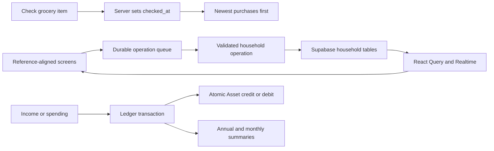

# Household Hub Web Parity Corrections

**Date:** 2026-07-25

**Status:** Approved in conversation; implementation pending

## Goal

Correct the rebuilt web application so its workflows, information hierarchy,
and visual behavior match the approved mobile references before Expo work
begins. Preserve the mobile-first Supabase model, durable operation queue,
responsive shell, and existing route structure.

## Source of truth

The implementation must follow, in priority order:

1. The decisions in this specification.
2. `docs/mobile-design-reference/README.md` and
   `docs/mobile-design-reference/Household Hub Mobile.dc.html`.
3. The supplied reference screenshots already stored in
   `docs/mobile-design-reference/`.
4. `docs/superpowers/specs/2026-07-24-web-first-household-hub-redesign.md`.

The primary navigation label remains **Calendar**, replacing the prototype's
older **Schedule** label.

## Approach

Use a targeted parity repair rather than rewriting the features:

- fix client/server command-shape mismatches at their source;
- add only the missing durable metadata required for correct behavior;
- restore proven interaction patterns from the retired page-based UI where
  they remain part of the approved product;
- complete the omitted Ledger summaries and data-entry controls; and
- retain the shared domain contracts, Supabase RPC boundary, RLS, operation
  receipts, IndexedDB queue, and Realtime invalidation.

Client-only timestamp approximations are rejected because `updated_at` changes
when a checked grocery item is edited and therefore cannot represent purchase
time. A broad screen rewrite is rejected because it would unnecessarily risk
working offline, RLS, posting, and conflict behavior.

## Confirmed root causes

### Calendar rejection

`buildEventPayload` currently includes both timed and all-day properties,
setting the inactive pair to `null`. The server contract requires the inactive
properties to be absent. The client reminder value `at-time` also differs from
the database enum value `at_time`.

### Grocery regressions

The rebuilt Grocery feature replaced household-wide autocomplete with an
exact-name price hint, does not render a full price-history view, and has no
durable checked timestamp. The current query orders checked items by stored
sort order rather than purchase time.

### Ledger omissions

The rebuilt Statements screen is a compact year select and month grid rather
than the approved list-first annual summary and monthly detail. `+ Year`
unconditionally submits the current year with a new entity UUID, which the
server correctly rejects when that year already exists. Income entry exists
only as a secondary state inside a generic transaction sheet, and new years do
not create the approved default income categories.

### Title editing and Notes

The shared inline title-editing behavior from the former page-based UI was not
ported consistently. The rebuilt Note screen mounts the editor at all times and
autosaves instead of presenting a saved read view with an explicit edit action.

### Trip currency discoverability

Trip Expenses already support CAD and one destination currency, but the
destination currency is an easily missed free-text field. A Trip created with
CAD as its destination currency therefore exposes only one currency. The
expense Asset selector also shows incompatible Assets before server-side
currency validation rejects them.

## Cross-cutting architecture

All writes continue through `enqueueOperation` and
`apply_household_operation(command)`. The server remains authoritative for
revisions, operation ordering, timestamps, posting atomicity, default category
creation, and currency compatibility.

Rejected or conflicted operations remain permanently discarded according to
the existing queue contract. Forms must surface the specific server explanation
instead of closing as if the operation succeeded.

## Calendar

### Payload contract

Timed event payloads contain:

- `startAt`
- `endAt`

They omit `startDate` and `endDate`.

All-day event payloads contain:

- `startDate`
- `endDate`

They omit `startAt` and `endAt`.

The client-facing reminder value `at-time` is mapped to `at_time` when building
the server command and mapped back when reading server rows. The remaining
values already match: `10m`, `1h`, `1d`, and `1w`.

### Save behavior

The form remains open when an operation is rejected or conflicted and displays
the returned reason. A queued offline save may close normally because it has
not received an authoritative rejection.

Timezone, recurrence, owner, note, timed/all-day, and multi-day behavior remain
otherwise unchanged.

## Shared detail-title editing

Grocery list, Note, and Trip detail titles share the same visible affordance:
the saved title uses page-title typography and is clearly activatable.

Grocery list and Trip titles use inline editing:

- Enter or blur saves;
- Escape or Cancel restores the saved title;
- a blank title is rejected locally;
- pending state prevents duplicate submission; and
- a rejected/conflicted save retains edit mode with the reason visible.

Activating a Note title enters the Note's full edit mode with the title focused.
The title is then committed only by the Note's explicit Save action, so title
and document changes remain one coherent update. The Trip's destination, dates,
timezone, and destination currency remain in its dedicated Edit form.

## Groceries

### Data model

Add nullable `checked_at timestamptz` to
`public.household_grocery_items`.

The server derives it during `grocery.item.upsert`:

- unchecked to checked: set `checked_at = applied_at`;
- checked to checked: preserve the existing value;
- checked to unchecked: set `checked_at = null`;
- new unchecked item: `null`;
- new checked item: `applied_at`.

Clients do not submit an arbitrary purchase timestamp. This prevents clock
drift and preserves server-authoritative operation order.

### Item order and display

Unchecked items retain the existing normal order. Checked items:

- appear after unchecked items;
- sort by `checked_at` descending;
- use a deterministic ID tie-breaker; and
- display the localized purchase date.

Example:

1. Milk — Jul 25, 2026
2. Eggs — Jul 23, 2026

Unchecking Milk removes its purchase date. Rechecking it later assigns the new
check date.

### Household-wide autocomplete

The add-item field searches a deduplicated union of:

- names of current items in every household grocery list; and
- retained names in household grocery price history.

Matching is case-insensitive substring matching, excludes an exact current
input match and names already present on the active list, and caps the visible
menu at eight suggestions. The menu is keyboard accessible. Choosing a
suggestion fills the name and shows the latest recorded price as a hint.

### Price history

Selecting an item reveals its five cheapest recorded prices across the
household, ordered:

1. `price_cents` ascending;
2. `recorded_at` descending for equal prices; and
3. ID descending as a deterministic tie-breaker.

Each row shows:

- formatted CAD price;
- recorded date; and
- grocery list/store name.

Example:

1. CA$3.49 · Jul 10, 2026 · Costco
2. CA$3.98 · Jul 22, 2026 · Save-on-food
3. CA$4.29 · Jul 5, 2026 · Costco
4. CA$4.49 · Jun 28, 2026 · Walmart
5. CA$4.99 · Jul 15, 2026 · Save-on-food

Price history remains immutable and survives item clearing/deletion. List
deletion retains the existing accepted database behavior for history associated
with that deleted list.

## Ledger Statements

### List-first annual screen

The Statements segment follows the reference:

- years are listed newest first;
- each year row has its own chart expand/collapse control;
- each year row has a detail navigation control; and
- the Statements segment has its own add-year action, separate from Assets.

An expanded year shows:

- total actual income;
- total actual spending;
- a spending-category donut and category totals; and
- monthly activity bars.

The monthly activity bars represent the sum of configured spending-category
limits for each month, not actual spending.

### Monthly detail

Opening a year shows:

- `Budget YYYY`;
- previous/next month controls;
- the month label opening a 4-by-3 month picker;
- a Monthly statement card with actual income, actual spending, spending
  category donut, and category totals;
- a monthly budget utilization card;
- Spent, Limit, and Left statistic cards;
- spending category progress bars; and
- visible Income and Spending transaction sections.

Calculations:

- monthly income = sum of income transactions;
- monthly spending = sum of spending transactions;
- monthly limit = sum of non-null spending-category limits;
- left = monthly limit minus monthly spending;
- utilization = spending divided by limit, with a defined empty state when the
  limit is zero; and
- annual actuals = sum of the twelve monthly transaction totals.

### Year creation

The add-year action opens a short form requiring a four-digit year. The client
checks the loaded year list and displays `YYYY already exists` without queuing
a command. The server uniqueness rule remains authoritative for concurrent
creation.

Creating a year creates:

- one Ledger year;
- all twelve Ledger months; and
- the default income categories propagated across all twelve months:
  - Salary
  - Bonus
  - RRSP
  - TFSA
  - ESPP
  - Government benefit

Users can add custom income categories. Income categories never have spending
limits.

### Income and spending entry

The selected month exposes separate `+ Income` and `+ Spending` actions. Each
form requires:

- category of the matching kind;
- Asset;
- positive amount;
- date; and
- description.

The month displays separate editable Income and Spending transaction lists.
Editing and deleting continue to reverse and reapply Asset postings atomically.
Income credits the selected Asset; spending debits it. Assets do not gain a
separate income-entry workflow.

### Charts

Use the approved semantic chart palette and accessible text equivalents. Charts
must not be the sole representation of monetary values. Empty and zero-value
states must render without invalid geometry or division by zero.

## Notes

### Read mode

Opening a saved note renders its restricted rich-text document as formatted,
non-editable content. Supported rendering remains limited to:

- paragraphs/body text;
- Heading 1–3;
- bullet lists;
- numbered lists; and
- checklists.

The read view visually matches the supplied Notes reference and does not mount
an interactive editor toolbar.

### Edit mode

An explicit Edit action opens title and document editing. The screen provides:

- Save;
- Cancel; and
- the existing restricted formatting controls, including undo and redo.

Save sends one coherent note update and returns to read mode after an applied,
duplicate, or durably queued result. A rejected/conflicted result remains in
edit mode with the reason visible. Cancel discards unsaved local changes and
restores the saved title and document.

The current per-keystroke/debounced autosave behavior is removed.

## Trips

### Destination setup

The New/Edit Trip form groups:

- destination city;
- destination timezone; and
- destination currency.

Destination currency is a required, manually entered three-letter ISO currency
code. Input is uppercased, validated, and previewed with the city and timezone
before save. Examples include `GBP`, `JPY`, and `USD`. No automatic currency
conversion or mandatory country lookup is added.

### Expenses

The Expenses tab remains the rightmost peer of Itinerary, Bookings, and
Checklist.

The expense currency control offers:

- CAD; and
- the Trip's destination currency, when it differs from CAD.

After currency selection, the Paid from control lists only Assets with that
currency. If no matching Asset exists, the form explains that a matching Asset
must be created and provides navigation to Ledger Assets. It does not submit a
known currency mismatch.

Totals remain separate and unconverted. Example:

- CAD: $5,309
- GBP: £2,409

CAD expenses create the linked Travel Ledger spending transaction and debit
the selected CAD Asset. Foreign expenses debit the matching foreign Asset and
do not create a CAD Ledger transaction.

## Error handling

Every form that awaits `enqueueOperation` must inspect the returned
`EnqueueOutcome`:

- `settled` with applied/duplicate: close and refresh;
- `queued`: close and show the normal pending-sync state;
- `discarded`: remain open and show the specific explanation.

Errors must not be reduced to generic success-like closure. Existing global
discard notifications remain as a secondary audit trail.

## Schema and compatibility

The correction requires forward migrations only:

- add Grocery `checked_at`;
- update the Grocery operation implementation;
- update year creation to seed default income categories; and
- add or update database tests for these behaviors.

Existing grocery rows remain valid with `checked_at = null`. Existing Ledger
years are non-destructively backfilled with any missing default income
categories, identified by stable system keys. Existing custom categories and
transactions are preserved; a default is not duplicated when its system key
already exists.

Generated database types must be refreshed after migrations. Hosted production
data is not reset.

## Testing and acceptance

### Database and contract

- Calendar timed and all-day payloads validate; inactive properties are absent.
- `at-time` maps to and from `at_time`.
- Grocery check/uncheck/recheck sets, clears, and replaces `checked_at`.
- Grocery history remains immutable.
- Year creation creates twelve months and six default income categories.
- Concurrent duplicate-year creation still produces the authoritative
  `year_already_exists` result.
- Income/spending posting behavior and Trip currency enforcement remain atomic.

### Web components

- Calendar creation and editing work for timed/all-day events and reminders.
- Detail titles save, cancel, reject blank input, and surface command failures.
- Grocery autocomplete is household-wide and keyboard accessible.
- Checked items display purchase dates newest first.
- Price history shows the five cheapest rows with store and date.
- Annual and monthly Ledger charts render correct totals and zero states.
- Duplicate years are blocked locally.
- Income and Spending actions use only matching categories.
- Note read/edit/save/cancel behavior preserves restricted JSON.
- Trip Expense currency filters Assets and explains missing matches.

### End-to-end

Use both seeded local accounts and persistent local Supabase data:

- create and edit a Calendar event;
- rename one Grocery list, Note, and Trip;
- reuse an autocomplete suggestion across Grocery lists;
- check, uncheck, and recheck items and verify order/date;
- record more than five prices and verify cheapest-five ranking;
- create a new Ledger year and verify months/default income categories;
- add income and spending against Assets and verify balances and graphs;
- save/cancel a Note edit and verify read mode;
- create CAD and foreign Trip expenses and verify separate totals and Ledger
  linkage; and
- verify phone-reference and desktop-sidebar layouts.

Run the complete Vitest suite, database reset/integration tests, lint,
TypeScript build, Vite production build, and `git diff --check`.

## Delivery sequence

Implementation is split into independently reviewable tasks. Each task uses
test-driven development, ends with verification and a commit, updates
`progress.md`, and stops for the user's detailed review:

1. Calendar operation-contract correction.
2. Grocery schema, purchase dates, autocomplete, history, and title editing.
3. Ledger year creation, default incomes, entry workflows, and charts.
4. Notes read/edit workflow and shared title editing.
5. Trip destination-currency and Asset-filtering workflow.
6. Cross-feature browser parity verification and handoff update.

Task 7, the Expo/mobile foundation, remains blocked until this web correction
pass is accepted.
