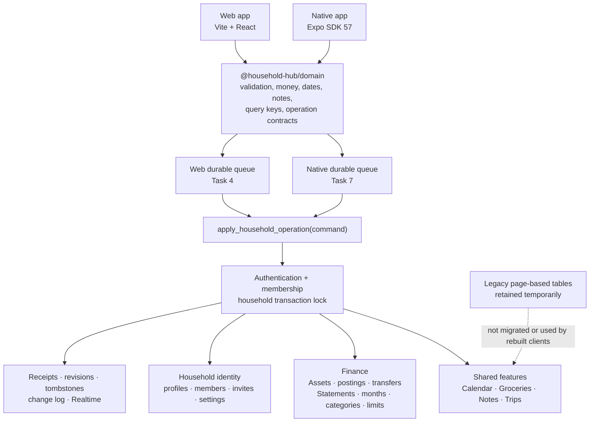
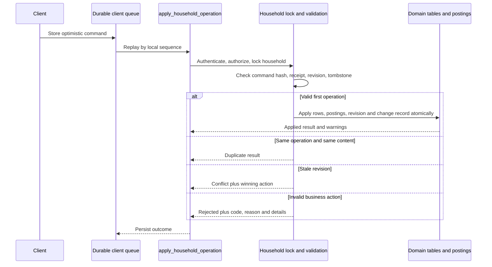

# Household Hub Mobile-First Implementation Progress

**Last updated:** 2026-07-25

**Canonical continuation file:** `progress.md`

**Implementation branch:** `codex/household-hub-mobile-first`

**Implementation worktree:** `/Users/conlegs/dev/household-hub/.worktrees/household-hub-mobile-first`
**Current HEAD:** `f86f4c0 test: cover two-device ordering through the queue`
**Last review-clean baseline:** `d1f3e30` (Tasks 1–2, independent review).
Tasks 3 and 4 are complete (self-reviewed); Task 5 is next.

This file is the source of truth for continuing the approved web-first
Household Hub rebuild. Current Git state and fresh verification results take
precedence if this file ever becomes stale.

## How to resume safely

1. Work from:

   ```bash
   cd /Users/conlegs/dev/household-hub/.worktrees/household-hub-mobile-first
   ```

2. Read, in order:

   - `progress.md`
   - `docs/superpowers/plans/2026-07-24-household-hub-web-first-native-parity.md`
   - `docs/superpowers/specs/2026-07-24-web-first-household-hub-redesign.md`
   - `CLAUDE.md`
   - `mobile/AGENTS.md` before changing Expo code

3. Reconcile the repository before editing:

   ```bash
   git status --short
   git log --oneline -12
   ```

4. Preserve the existing untracked reference/scaffold files unless the active
   task explicitly brings them into scope:

   - `DEPLOYMENT.md`
   - `docs/mobile-design-reference/`
   - `docs/mobile-implementation-handoff.md`
   - the still-untracked files under `mobile/`

5. Resume at **Task 5 (responsive web shell and visual system)**. Tasks 1–4
   are complete, committed, and verified — do not redo them.

6. **User directive (2026-07-25):** work straight through **3C → 3D** to finish
   Task 3, then **proceed into Task 4** — the user has pre-approved starting
   Task 4, so do NOT stop for the inter-task approval gate between Task 3 and
   Task 4. Still commit + verify each sub-checkpoint, and still provide a
   detailed written report at the Task 3 completion boundary and again at the
   Task 4 completion boundary. (The original "checkpoint after every task /
   don't start Task 4 without approval" rule is superseded only for this Task
   3 → Task 4 hand-off.)

## Approved product direction

- Rebuild and validate the web application first.
- Phone web and native follow the supplied mobile design reference.
- Desktop web keeps a wider left navigation pane with the same behavior.
- Primary destinations are Calendar, Groceries, Ledger, Notes, and Trips.
- Calendar is the default destination. There is no Home destination.
- The header contains the rabbit/penguin identity, Notifications, and Settings.
- Notes retain multiple named documents.
- Web, iOS, and Android use one Supabase backend and one shared domain contract.
- Native targets portrait phones only.
- Production application data will start empty, but the production reset must
  not run until a separate release-time approval.

## Progress summary

| Task | Status | Completion |
| --- | --- | --- |
| 1. Shared foundation and domain contracts | Complete | Review-clean at `ffc3c01` |
| 2. Supabase schema and operation RPC | Complete | Review-clean at `d1f3e30` |
| 3. Identity, notifications, jobs, deployment config | Complete | Verified at `24a5b39` (self-review; no independent review agent) |
| 4. Durable web operation queue | Complete | Verified at `f86f4c0`; its UI surface lands with Task 5 |
| 5. Responsive web shell and visual system | Pending | Not started |
| 6. Web feature flows | Pending | Not started |
| 7. Expo foundation and offline data layer | Pending | Not started |
| 8. Expo feature parity and visual implementation | Pending | Not started |
| 9. Reset procedure, E2E verification, release handoff | Pending | Not started |

## Architecture after Tasks 1 and 2



### Authoritative operation lifecycle



## Task 1 — Shared foundation and domain contracts

### Delivered

Created the internal pure-TypeScript package:

```text
packages/domain/
├── src/calendar.ts
├── src/money.ts
├── src/notes.ts
├── src/operations.ts
├── src/queryKeys.ts
├── src/trips.ts
├── src/validation.ts
└── src/index.ts
```

It is consumed by both the root Vite application and the Expo package.
TypeScript, Vite, npm workspace, and Metro resolution were updated without
placing React UI in the shared package.

### Shared validation

- UUID identifiers
- Safe integer cents, including signed and positive schemas
- Explicit ISO 4217 currency validation
- IANA timezone validation
- Strict ISO dates and datetimes, including rejection of normalized impossible
  dates such as February 30
- Mutable revisions beginning at 1
- Local sequence and operation-envelope validation

### Money, Calendar, and Trips

- Currency-aware cents formatting
- No currency conversion
- Timed Calendar events use UTC instants and a source timezone
- All-day Calendar events preserve fixed dates
- Trip totals aggregate into separate currency buckets

### Notes contract

The shared rich-note JSON validator accepts only:

- document
- paragraph
- text
- hard break
- Heading 1–3
- bullet list
- numbered list
- checklist
- list item
- checklist item with a Boolean checked value

Images, links, unsupported marks, arbitrary attributes, and invalid nested
content are rejected.

### Durable operation contract

Commands include:

- schema version
- operation ID
- device ID
- local sequence
- household ID
- allowlisted operation type
- entity type and entity ID
- base revision
- enqueue timestamp
- strict payload

Results form a discriminated union:

- `applied`: server sequence, resulting revision, optional details/warnings
- `duplicate`: original server sequence
- `conflict`: current revision and winning operation/entity details
- `rejected`: stable code, reason, structured details, and warnings

### Task 1 commits

- `d49035d feat: add shared domain contracts`
- `ffc3c01 fix: tighten domain contract validation`

### Task 1 review

The first review found seven important gaps:

1. The Expo package depended on untracked entry/config files.
2. Required Ledger/transfer/schedule operation families were absent.
3. Conflict results did not require winner details.
4. Currency validation accepted non-ISO three-letter strings.
5. Calendar accepted impossible normalized dates.
6. Notes accepted invalid fields on node types.
7. The Notes document type disagreed with runtime validation.

All seven were fixed. The scoped re-review approved Task 1 with no new
Critical or Important issues.

## Task 2 — Mobile-first Supabase schema and authoritative RPC

### Ordered migrations

- `supabase/migrations/20260725010000_mobile_first_schema.sql`
- `supabase/migrations/20260725011000_household_operation_rpc.sql`
- `supabase/migrations/20260725012000_mobile_first_security_realtime.sql`

These migrations retain the legacy page-based schema but add the mobile-first
model beside it.

### Identity and household schema

- Existing households now carry an owner.
- Profiles store global display identity.
- Household members are restricted to one active household per auth user.
- Household invites store only token hashes and support expiry, revocation,
  and redemption state.
- Household user settings store appearance and notification preferences.
- The maximum-two-member behavior is supported for the onboarding/admin
  operations implemented in Task 3.

### Assets

- `ledger_assets`
- immutable `asset_postings`
- `ledger_transfers`
- `ledger_transfer_schedules`
- idempotent schedule occurrences
- a security-invoker balance view derived from postings

Asset balances are not maintained as independently mutable totals. Income,
spending, transfers, and Trip expenses produce immutable posting effects.

### Ledger

- Statement years
- exactly twelve month rows per created year
- stable category identities
- month-specific category configuration
- nullable monthly spending limits
- income and spending transactions
- default income category support
- unbudgeted Travel category support

Category and limit changes propagate from the selected month through December.
Earlier months remain unchanged.

Category deletion is rejected when spending exists in the selected or any
later affected month. The structured rejection identifies blocking months.

### Calendar

The existing Calendar table is extended rather than replaced:

- UTC timed boundaries
- IANA event timezone
- date-fixed all-day boundaries
- revision values
- multiple reminder presets

Existing Calendar rows are backfilled into the entity-revision registry so
they can immediately participate in queued mutation conflict handling.

### Groceries, Notes, Trips, and Notifications

- Standalone grocery lists, items, and immutable price history
- Multiple named Notes with restricted JSON documents
- Standalone Trips with destination timezone
- Itinerary, bookings, checklist, and expenses
- Notification inbox records and device-facing metadata

### Operation infrastructure

- per-household server sequence state
- idempotent operation receipts
- entity revision registry
- tombstones
- household change log
- safe Realtime publication metadata

### `apply_household_operation`

The security-definer RPC:

1. Validates authentication and household membership.
2. Locks the household row to serialize operations.
3. Rechecks and locks membership under the household lock.
4. Rejects oversized, malformed, or extra-key payloads.
5. Uses a fixed allowlisted dispatch; no dynamic SQL.
6. Hashes canonical command content.
7. Returns `duplicate` for an identical operation replay.
8. Rejects operation-ID reuse with different content.
9. Checks base revision and tombstone state.
10. Applies domain rows, financial postings, revision, receipt, and change log
    atomically.
11. Returns structured negative-balance warnings.

### Financial invariants

- Ledger income uses a positive Asset posting.
- Ledger spending uses a negative Asset posting.
- Edits append reversals/deltas rather than rewriting posting history.
- Deletes reverse their financial effect.
- Negative balances are allowed but reported.
- Transfers require distinct Assets in the same currency.
- Transfer edits/deletes warn about any source, new destination, or old
  destination driven below zero.
- Asset currency cannot change while referenced by a posting, transaction,
  transfer, schedule, or Trip expense.
- Recurring transfers have no income/spending effect.

### Trip expense behavior

CAD expense:

- creates the Statement year and all twelve months when absent
- creates or repairs the system Travel category
- leaves Travel unbudgeted when no explicit limit exists
- creates one linked Ledger spending transaction
- uses that Ledger posting as the Asset debit, avoiding double debit

Foreign expense:

- requires an Asset matching the Trip destination currency
- creates one foreign Asset debit
- creates no CAD Ledger transaction
- performs no conversion

Trip totals therefore remain separate, for example:

```text
CAD $5,309
GBP £2,409
```

### Typed-year clear

`ledger.year.clear` requires the exact year confirmation and removes only the
selected Statement year’s Ledger data.

When CAD Trip expenses are linked to that year:

- the Trip expenses remain
- their Ledger links are detached
- their Asset effects are converted to Trip-origin postings
- Asset balances remain accurate
- ordinary Ledger postings are reversed

### Revision and conflict integrity

Indirect parent operations also maintain child revision streams:

- deleting/editing Trip expenses tombstones generated Ledger children
- deleting a year advances or tombstones affected child entities
- partial category deletion advances category/limit child revisions
- Travel restoration preserves stable identities and invalidates stale queued
  operations
- limit identity cannot be replaced by a competing null-base operation

### Security

- Members can read only their household’s rows through RLS.
- New mutable tables deny direct authenticated writes.
- Existing `households` and `household_members` explicitly revoke
  `INSERT`, `UPDATE`, `DELETE`, and `TRUNCATE`.
- Helper functions revoke execution from `PUBLIC`, `anon`, and
  `authenticated`.
- Only the public operation RPC is granted to authenticated users.
- Security-definer functions use an explicit safe search path.
- Realtime publishes user-facing tables/change metadata, not private receipt
  or device command data.

### Task 2 commits

- `f732c1d feat: add mobile-first household schema`
- `5c3f5cd feat: add authoritative household operation RPC`
- `6d4a122 test: secure mobile-first database operations`
- `ad62d8e fix: close mobile operation security gaps`
- `d1f3e30 fix: harden mobile operation invariants`

### Task 2 review

The official review found eight Important issues:

1. Existing Calendar rows were outside the revision system.
2. Trip-generated Ledger children could be recreated by stale commands.
3. Asset/Trip currency changes could invalidate dependent records.
4. Transfer deletion could omit a negative-balance warning.
5. Partial Travel deletion could break later CAD Trip expenses.
6. Competing limit IDs could bypass revision conflicts.
7. Global profiles could receive multiple household revision streams.
8. Extended tenancy tables retained explicit DML grants.

The fix round added regression coverage and corrected all eight. Additional
review during the fix found and corrected:

- partial category/Travel repair child revision gaps
- stale category/limit operations after parent mutations
- transfer-edit warnings for the previous destination Asset
- real pre-migration Calendar upgrade behavior

The official scoped re-review marked every original finding addressed and
found no new Critical or Important breakage.

## Current verification baseline

Freshly verified at `d1f3e30`:

| Verification | Result |
| --- | --- |
| `supabase db reset --local` | Passed |
| Main operation pgTAP suite | 89/89 passed |
| Review regression pgTAP suite | 81/81 passed |
| Pre-migration Calendar upgrade harness | 81/81 passed, no skips |
| `supabase db lint --local --schema public --level warning --fail-on error` | No errors |
| `npm test -- --run` | 34 files, 216/216 passed |
| `npm run lint` | Passed |
| `npm run build` | Passed |
| `git diff --check ffc3c01..d1f3e30` | Passed |

Expected existing warnings:

- Supabase reports the old `[inbucket]` local config section as deprecated.
- Node prints the existing experimental `localStorage` warning during Vitest.
- Vite reports an existing main-bundle chunk larger than 500 kB.
- Dependency audits currently report existing package vulnerabilities; no
  broad dependency upgrade was performed in Tasks 1 or 2.

## Known constraints and release risks

1. **No remote changes:** all database verification used local Supabase. No
   production or hosted Supabase project was changed.
2. **No data reset:** the production clear procedure is Task 9 and requires
   explicit release-time approval.
3. **Migration deployment:** the three Task 2 migrations are new and have not
   been deployed remotely. If an environment somehow records an earlier
   intermediate version, create later corrective migrations instead of
   relying on edits to an applied migration.
4. **Legacy membership preflight:** the one-user/one-household unique
   constraint will deliberately fail if legacy data has a user in multiple
   households. Run a duplicate-membership query and resolve any rows before
   hosted deployment.
5. **Future household rejoin:** leaving/rejoining another household needs an
   explicit profile-revision reset or migration strategy.
6. **Concurrent-session test:** household locking is implemented and sequence
   behavior is tested, but a true two-simultaneous-session race test remains
   for Task 9.
7. **Live Realtime:** publication and replica-identity metadata are verified;
   live two-client websocket delivery remains for Task 9.

## Task 3 — In progress

Being executed in ordered sub-checkpoints (commit + verify after each) because
Task 3 is large; this keeps progress durable across sessions.

### Done: 3A domain contracts (`47f1763`)

Added the household-administration domain layer in `@household-hub/domain`:

- `packages/domain/src/households.ts` — `householdAdminActions` allowlist
  (`household.onboard`, `invite.create|revoke|redeem`, `ownership.transfer`,
  `member.remove`, `account.delete`, `household.delete`) with strict
  per-action payload validation (exact key set + per-field validators, extra
  keys rejected); `MAX_HOUSEHOLD_MEMBERS = 2`, `INVITE_TTL_DAYS = 7`,
  `READ_NOTIFICATION_TTL_DAYS = 90`; `HouseholdAdminResult` ok/rejected guard.
- Admin actions are modeled **separately from `operationTypes`** — they are
  synchronous, online-only, and executed by security-definer RPCs / service-
  role Edge Functions, not queued through the durable operation queue.
- `packages/domain/src/calendar.ts` — `reminderPresets`
  (`none|at-time|10m|1h|1d|1w`), `isReminderPreset`, and `reminderLeadMinutes`.
- Tests: `households.test.ts` (+8), reminder cases in `calendar.test.ts` (+2).

Verified under arm64 node: `npx vitest run` 35 files / 226 passed;
`npm run lint` clean; `npm run build` clean.

### Done: 3A DB (`f283ad3`)

`supabase/migrations/20260725013000_household_admin_operations.sql` — seven
security-definer RPCs: `onboard_household`, `create_household_invite`,
`revoke_household_invite`, `redeem_household_invite`,
`transfer_household_ownership`, `remove_household_member`, `delete_household`.
Each takes the actor from `auth.uid()`, derives the household from the actor's
own membership (no household_id parameter → no IDOR), serializes under the
household `FOR UPDATE` lock, enforces the two-member cap, and returns the
shared HouseholdAdminResult shape via a private `mobile_admin_rejected` helper.
Invites store only a sha256 hash of a 32-byte url-safe token; creating a new
invite supersedes the prior active one. Direct client DML stays revoked; only
these seven functions are granted to `authenticated`. **Account deletion
(auth.users removal + created_by reconciliation) is deferred to the 3C Edge
Function.** Tests: `supabase/tests/20260725_household_admin.test.sql` (33
pgTAP assertions). Verified: `supabase db reset --local` clean; `supabase test
db --local` 3 files / **203 tests pass**; `supabase db lint` no errors.

### Done: 3B auth code (`e173e07`)

Shared auth policy in `@household-hub/domain` (`auth.ts`): `oauthProviders`
(`google`, `apple`) + guard, and `isPasswordAuthAllowed` requiring BOTH
non-production AND the test-auth flag (production is OAuth-only, cannot expose
the password path). Web helpers (`src/lib/auth.ts`): `signInWithOAuth`
(redirect `/auth/callback`) and a guarded `signInWithTestPassword`. Verified:
`npx vitest run` 36 files / **228 tests pass**; lint + build clean.
**Deferred to 3D:** `config.toml` external-provider wiring + `.env` templates
(kept with the other config changes so local `db reset`/`start` stays stable).

### Done: 3C DB layer (`1231941`)

`supabase/migrations/20260725014000_notifications_devices_and_jobs.sql`:

- **Tables** — `notification_devices` (Expo token per user+install, platform,
  `disabled_at`, `failure_count`), `calendar_reminder_dispatches` (unique on
  `(event_id, preset, occurrence_start)` → re-timing an event re-fires its
  reminder; a retried scheduler run does not), `notification_push_deliveries`
  (unique on `(notification_id, device_row_id)`). Client DML revoked; only
  `notification_devices` is client-readable (own rows), the two job ledgers are
  not readable at all.
- **Partner-only Calendar activity** — trigger on `household_change_log`
  (written last in `apply_household_operation`, after the receipt, so the actor
  is available). Kinds `calendar.event.created|updated|deleted`, recipients =
  members other than the actor. Deleted events carry `title: null` (the row is
  already gone) but keep `entityId` for the deep link.
- **Authenticated RPCs** — `register_notification_device` (reclaims a token
  Expo reissued to another install so delivery can't strand on a stale row),
  `unregister_notification_device`, `update_user_settings` (appearance +
  notifications_enabled; profile DML stays revoked).
- **Service-role job contract** — `job_calendar_reminder_candidates`,
  `job_record_calendar_reminder` (reminders go to *every* member, unlike
  activity), `job_pending_push_notifications` (skips opted-out recipients,
  disabled devices, and already-delivered pairs), `job_record_push_delivery`,
  `job_disable_notification_device`, `job_active_transfer_schedules`,
  `job_execute_transfer_occurrence` (balanced postings mirroring
  `ledger.transfer.upsert` legs; idempotent on `(schedule_id,
  occurrence_date)`; negative-balance warning without blocking),
  `job_cleanup_read_notifications`, `admin_prepare_account_deletion`.
- **Account deletion** — owner+partner → `must_transfer_ownership`; sole owner
  → household deleted with the account; non-owner → leaves and their authored
  rows are reassigned to the owner via `mobile_reassign_authorship` (every
  `created_by`/`recorded_by` is ON DELETE RESTRICT, legacy page tables
  included, so `auth.users` deletion is otherwise blocked). The Edge Function
  removes the `auth.users` row afterwards.
- **Removed-member cleanup** — trigger on `household_members` delete drops that
  user's devices and inbox rows for the household.

Verified: `supabase db reset --local` clean; `supabase test db --local`
4 files / **292 tests pass** (89 new); `supabase db lint` no errors.

### Done: 3C Edge Functions (`df02de6`)

`supabase/functions/` — five functions plus tested pure modules:

- **`_shared/timezone.ts`** — `Intl`-based offset resolution (Temporal is not
  on the edge runtime). Fall-back wall times resolve to the *earlier* instant;
  spring-forward gap times resolve to the transition instant itself (found by
  a minute-granularity binary search), so a 02:30 anchor on a spring-forward
  day still runs, at 03:00 local.
- **`_shared/reminders.ts`** — all-day events anchor to 09:00 in the event
  timezone while the dispatch key stays the event's own start (so re-timing an
  event re-fires, a retried run does not); `none`/unknown presets never fire;
  reminders past the 60-minute grace window are dropped instead of delivered
  late; candidate window = grace back, longest lead + 1 day forward.
- **`_shared/schedules.ts`** — occurrence enumeration for the four
  frequencies in the schedule's own timezone (wall-clock preserved across
  DST). Monthly re-derives from the anchor day so a February clamp doesn't
  drag later months; semi-monthly pairs the anchor day with one 15 days away;
  a run materializes at most 24 occurrences so an outage catches up in
  bounded batches.
- **`_shared/expo.ts`** — one message per (notification, enabled device),
  malformed tokens dropped, 100-message batches, positional ticket matching;
  a short/missing ticket becomes `MissingTicket` rather than a silent drop,
  and `DeviceNotRegistered` marks the device for disabling.
- **`_shared/http.ts` / `_shared/supabase.ts` / `_shared/json.ts`** — CORS,
  method/body guards, constant-time service-role check, and a dependency-free
  PostgREST/Auth client (no SDK bundle runs with the service-role key, and
  `deno check`/`deno test` work offline).
- **`household-admin`** — one audited entry point for every administration
  action. Strict `{action, payload}` validation mirroring the domain contract;
  RPC actions run as the *caller* (RLS and `auth.uid()` still apply); the
  typed household name is verified against the stored name server-side; account
  deletion runs `admin_prepare_account_deletion` first and only removes the
  `auth.users` row when the database accepted, so a rejection leaves the
  account intact.
- **`calendar-reminder-scheduler`**, **`push-dispatch`**,
  **`recurring-transfer-executor`**, **`notification-cleanup`** — service-role
  only. Push deliveries are recorded per (notification, device); a transport
  failure records nothing so the next run retries, while an Expo-reported
  error is recorded as permanent (the inbox row remains the durable record).

Also: `npm run test:functions` (`deno test supabase/functions/`),
`src/test/edgeFunctionParity.test.ts` (asserts the edge copies of the reminder
presets, admin actions, name/code validation, and the 90-day TTL still match
`@household-hub/domain`), and a Vitest `exclude` for `supabase/**` so Vitest
no longer tries to load the Deno tests.

Verified: `deno test supabase/functions/` **73 passed**; `npx vitest run` 37
files / **233 passed**; `npm run lint` clean; `npm run build` clean;
`deno check` clean.

### Done: 3D config and deployment (`24a5b39`)

- **`supabase/config.toml`** — `[functions.*]` for all five functions with
  `verify_jwt = true`; `[auth.external.google]` beside Apple (both disabled
  locally unless the client id/secret are exported); web `/auth/callback` and
  native `householdhub://auth/callback` redirect URLs; `site_url` corrected to
  the Vite dev port.
- **Env templates** — `.env.example` and `mobile/.env.example` name every
  variable (web, Expo, seed script, local provider secrets, function secrets)
  with none of their values.
- **Seed fixtures** — `scripts/seed-household.ts` now provisions through the
  real path (`onboard_household` → `create_household_invite` →
  `redeem_household_invite`) instead of writing `households`/
  `household_members` directly, so seeded rows carry owner role, profiles, and
  invite redemption state. Still idempotent (membership check is scoped to the
  partner's own row — a member can read both).
- **`src/types/database.ts`** — regenerated from the local stack. This
  surfaced that the pre-rebuild Calendar screen assumed non-null
  `start_at`/`end_at`, which Task 2 widened; it now goes through
  `toLegacyCalendarEvent` (all-day rows are filtered out of that screen) until
  Task 6 replaces it.
- **`vercel.json`** — SPA rewrite plus cache headers: hashed `/assets`
  immutable for a year; `index.html`, `sw.js`, and the web manifest must
  revalidate.
- **Expo** — `mobile/app.json` carries the release identity (`householdhub`
  scheme, `com.conlegs.householdhub`, portrait, `supportsTablet: false`,
  `POST_NOTIFICATIONS`); `mobile/eas.json` defines development/preview/
  production profiles. `app.json`, `.gitignore`, and `assets/` were previously
  untracked and are now committed (the remaining Task 1 review gap).
  `expo-notifications` and its config plugin arrive in Task 7, so no plugin
  block is declared yet.
- **`docs/deployment/mobile-first-rollout.md`** — env matrix, migration
  preflight, OAuth setup, function deploy + cron cadences, Vercel, EAS, and
  seeding. No provider secrets.

#### Defect found by end-to-end verification (fixed)

Running the real functions against the local stack showed a partner could
**never delete their account**: `admin_prepare_account_deletion` accepted, then
removing the `auth.users` row failed because
`household_invites.redeemed_by` used `ON DELETE SET NULL` while the table
requires `redeemed_at`/`redeemed_by` to be null or non-null together.
`supabase/migrations/20260725015000_invite_redeemer_deletion.sql` cascades the
spent invite with its redeemer;
`supabase/tests/20260725_invite_redeemer_deletion.test.sql` (9 assertions)
fails against the old constraint and passes with the new one.

## Task 3 — complete

### Task 3 verification baseline (at `24a5b39`)

| Verification | Result |
| --- | --- |
| `supabase db reset --local` | Passed |
| `supabase test db --local` | 5 files, **301/301 passed** |
| `supabase db lint --local --schema public --level warning --fail-on error` | No errors |
| `npm run test:functions` (Deno) | **73/73 passed** |
| `npx vitest run` | 37 files, **233/233 passed** |
| `npm run lint` | Passed |
| `npm run build` | Passed |
| `supabase gen types typescript --local` | Matches the committed file |

Live end-to-end against the local stack (`supabase functions serve`, all five
functions booted):

- job functions reject an anon key (`forbidden`) and accept the service role;
- `notification-cleanup` rejects `ttlDays: 0`, runs with the default 90;
- `household-admin` rejects unauthenticated calls, unknown actions, non-POST
  verbs, and a mistyped household name (reporting the expected name);
- a seeded partner deleted their own account (authorship reassigned to the
  owner, household intact), the owner then created an invite, and finally
  deleted their own account, taking the household with it.

### Known Task 3 risks carried forward

1. **Permanently failing push batch** — a batch Expo never accepts records no
   delivery row (so it retries), which means a message Expo rejects at the
   transport level retries on every run. Bounded by the 100-notification page,
   but worth an attempt cap if it is ever observed.
2. **No independent review agent was run** for Task 3. The session directive
   is not to dispatch subagents, so this was a self-review plus the live
   end-to-end run above. `/code-review` on this branch remains available and
   is the recommended follow-up.
3. **Nothing deployed remotely.** All verification is local; no hosted
   Supabase project, Vercel deployment, or EAS build was touched.
4. **Expo push not exercised against Expo's servers** — batching and ticket
   handling are unit-tested; real delivery needs the Task 7 development build.

## Task 4 — Durable web operation queue (complete)

### Done: queue core (`dba54b5`)

`src/lib/operations/` — the rebuilt clients' only write path.

- **`types.ts`** — `QueuedOperation` (command, device id, local FIFO sequence,
  optimistic state, attempts, last error) and `DiscardedOperation` (the losing
  command, the winner, code/reason/details, acknowledgement).
- **`device.ts`** — device id persisted in IndexedDB (a new id every session would
  restart the server's per-device ordering mid-stream); local sequence
  allocated inside a transaction so concurrent enqueues cannot collide.
- **`queue.ts`** — durable-first enqueue (stored before any network attempt),
  then a FIFO replay against `apply_household_operation`:
  - `applied` / `duplicate` → leave the queue;
  - `conflict` / `rejected` → leave the queue as a permanent discard record;
  - transport failure → **stop the pass**, do not skip ahead (order is part of
    the contract and a later command may depend on an earlier one);
  - an unrecognized response is treated as a transport failure, never as a
    verdict, so a write is never silently dropped;
  - single in-flight guard, and identifiers validated (not cast) at the
    boundary through the domain's `isUuid`/`isRevision`.
- **`overlay.ts`** — optimistic overlays derived from the queue itself, so a
  Realtime refetch cannot erase an unsent local edit, and the overlay survives
  a reload exactly as the commands do. Per-entity queued commands apply in
  local sequence order.
- **`src/lib/db.ts`** — Dexie v2 adds `operations` and `discardedOperations`.
  The legacy `outbox` stays until Task 6 retires the legacy screens with it.
- **`AppShell`** — registers the query client and starts the sync loop
  (online, visibility, 30s fallback) beside the legacy one.

### Done: explanations and status (`098f643`)

`explainDiscard` turns a discard record into the account the design requires —
the action that failed, the one that won, the server's wording, and the stable
code — because a losing command is never retried or edited.
`useOperationQueueStatus` / `useDiscardedOperations` are live Dexie queries for
the Task 5 shell.

### Done: Realtime reconciliation (`336a89d`)

`useHouseholdRealtime` subscribes once per household to
`household_change_log` (written by every applied operation) instead of one
channel per table; an event invalidates the household's queries and nudges the
queue, and the refetch goes back through the overlay.

### Task 4 verification (at `f86f4c0`)

| Verification | Result |
| --- | --- |
| `npx vitest run` | 40 files, **267/267 passed** (34 new) |
| `npm run lint` | Passed |
| `npm run build` | Passed |
| `npm run test:functions` | 73/73 passed |
| `supabase test db --local` | 5 files, 301/301 passed |

New coverage: offline CRUD, reconnect replay in FIFO order, recovery after a
reload, duplicate verdicts, transport-failure stop-and-resume, unrecognized
responses, conflict and rejection discard, acknowledgement, two-device
ordering (one entity lost to the partner while the rest of the queue still
applied in order), overlay behavior for create/edit/delete, and Realtime
reconciliation.

### Remaining for Task 4

- Nothing functional is outstanding for the queue itself. The remaining plan
  items for Task 4 (a visible pending/conflict surface) land with the shell in
  Task 5, which owns every UI state.

## Original Task 3 scope (unchanged reference)

Task 4 start was **pre-approved** by the user (see "User directive" above).

### Task 3 scope

- Google OAuth for web and native callback contracts
- Apple OAuth for web and native callback contracts
- local/test-only email/password path guarded by development mode and an
  explicit test-auth flag
- first-user household creation and ownership
- seven-day, one-time invitation link/code
- invitation regeneration, revocation, and redemption
- maximum two active household members
- ownership transfer
- partner removal
- account and household deletion rules
- Edge Functions for:
  - household invitations/admin
  - Expo push dispatch
  - Calendar reminder scheduling
  - recurring Asset transfer execution
  - read-notification cleanup after 90 days
- reminder presets:
  - none
  - at time
  - 10 minutes
  - one hour
  - one day
  - one week
- partner-only Calendar activity notifications
- Supabase config and environment templates
- local seed fixtures
- generated database TypeScript types
- Vercel cache/environment configuration
- Expo scheme, application identifiers, permissions, and EAS profiles
- deployment documentation without provider secrets

### Task 3 acceptance boundary

Task 3 should stop after:

- implementation is committed
- focused tests pass
- full affected verification passes
- an independent task review has no open Critical or Important issues
- a detailed checkpoint report is provided to the user

Do not start Task 4 until the user approves continuing.
