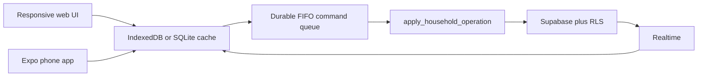

# Household Hub — Current Progress

**Last updated:** 2026-07-26

**Canonical continuation file:** `progress.md`

**Detailed completed-task archive:** `docs/superpowers/progress-detail.md`

**Branch:** `codex/household-hub-mobile-first`

**Worktree:** `/Users/conlegs/dev/household-hub/.worktrees/household-hub-mobile-first`

## Current state

Tasks 1–8 are implemented. The latest Task 7/8 correction completed Trip
Itinerary/Bookings/Checklist, persisted native queries, optimistic overlays,
mounted Realtime, Notifications, push lifecycle, secure sessions, local test
credentials, and EAS development builds.

Manual testing on 2026-07-26 found the UI/behavior issues listed below.
**All of those findings have been implemented and reviewed** (implemented via
`superpowers:subagent-driven-development`, plan:
`docs/superpowers/plans/2026-07-26-manual-test-correction-pass.md`; every
task's diff passed an independent spec-compliance + code-quality review).
Task 9 is cleared to start per explicit user approval ("move to Task 9 if the
manual-test findings are all fixed").

| Work | Status |
| --- | --- |
| Tasks 1–6: foundation, backend, queue, web shell/features | Complete |
| Task 7: Expo foundation and offline layer | Complete and accepted |
| Task 8: native parity plus completion correction | Complete |
| Manual-test correction pass | Complete and reviewed (2026-07-26) |
| Task 9: reset, E2E acceptance, release handoff | Cleared to start |

## Resume checklist

1. Work only from:

   ```bash
   cd /Users/conlegs/dev/household-hub/.worktrees/household-hub-mobile-first
   ```

2. Read:

   - `progress.md`
   - `docs/superpowers/plans/2026-07-24-household-hub-web-first-native-parity.md`
   - `docs/superpowers/specs/2026-07-24-web-first-household-hub-redesign.md`
   - `docs/mobile-design-reference/README.md`
   - `mobile/AGENTS.md` before changing Expo code
   - `docs/superpowers/progress-detail.md` only when historical implementation
     detail is needed

3. Reconcile current code before editing:

   ```bash
   git status --short
   git log --oneline -12
   ```

   Current code and Git state override documentation if they differ.

4. Preserve the existing reference files:

   - `DEPLOYMENT.md`
   - `docs/mobile-design-reference/`
   - `docs/mobile-implementation-handoff.md`

5. Do not implement the findings below until the user explicitly starts the
   correction pass.

## Next correction pass — manual-test findings (resolved 2026-07-26)

All findings below are implemented, tested, and reviewed. Kept verbatim for
the historical record; see each note for the actual resolution and any
follow-up still owed.

### Calendar

1. **Event-dot alignment**
   - Current: adding the event dot changes/breaks date-number alignment in the
     month grid.
   - Required: every date remains aligned consistently whether it has zero,
     one, or multiple events. The indicator must not change the date cell's
     layout height or number position.

2. **Move event ownership out of the legend**
   - Remove the `Yongju / Claire / Shared` legend above the calendar.
   - Show the owner on each event row in the selected-date event list below the
     calendar.
   - Preserve the distinction between Yongju, Claire, and Shared at the event
     row level.

**Resolved:** ported `buildOwnerColors` into `packages/domain` (deterministic
per-member colors + "You"/name/"Shared" labels); web and mobile event rows now
show it. Mobile's dot is `position: absolute` so it no longer perturbs the
date number; the fake hardcoded legend is deleted.

### Groceries

1. Autocomplete currently works and must be preserved.
2. Price history is missing and must return.
3. Show no more than five price-history entries for the Grocery item.
4. Display the selected entries from cheapest at the top to most expensive at
   the bottom.
5. Keep the purchase date visible for each price.

**Clarification required before implementation:** “last five histories based
on price” could mean either:

- take the five most recent purchases, then sort those five by price; or
- take the five cheapest purchases from all retained history.

Do not choose silently; confirm the intended candidate set first.

**Resolved:** user confirmed "5 cheapest ever recorded." Investigation found
this — and autocomplete — was **already fully implemented and tested** on
both platforms (`cheapestPriceHistory()`, committed 2026-07-25, before this
manual test), matching the confirmed behavior exactly. No code change; web
(`groceryData`/`GroceryListScreen` tests) and mobile
(`groceries/data.test.ts`) suites re-verified passing. A live browser
click-through was **not** performed (no network egress in the sandbox to
install a headless browser) — do one manual spot-check before Task 9's
device testing if you want independent confirmation.

### Ledger

1. **Missing Statement creation path**
   - Current: Ledger can show `Statement not found`, but there is no visible
     action to create one.
   - Required: expose a clear add-Statement action from the empty/missing state
     and the Statements screen.

2. **Statement-year selection**
   - Replace manual year typing with a year list.
   - Years that already have a Statement remain visible but disabled.
   - Only uncreated years are selectable.
   - Preserve the existing fixed four-digit year validation at the operation
     boundary.

3. **Annual Statement scope**
   - The 12-month Statement page should show the annual Statement summary.
   - Remove monthly budget-limit presentation from the 12-month annual view.
   - Monthly budget limits belong only in the selected month’s budget/detail
     view.

**Resolved:**
1. Both platforms' per-year "Statement not found" state now has a "Back to
   Ledger" action (the Statements-tab-level "+ Year"/"Create year" actions
   already worked and were untouched).
2. `NewYearSheet` replaced the free-text year input with a year list (native
   `<select>` on web; a rebuilt tap-to-open `SelectField` on mobile — see
   below), existing years shown disabled. Mobile's `SelectField` itself was
   rebuilt from an always-visible `@react-native-picker/picker` wheel into a
   tap-to-open menu (used by 6+ other sheets too, with zero call-site
   changes); `@react-native-picker/picker` removed from `mobile/package.json`.
   **Known gap:** the root `package-lock.json` still lists
   `@react-native-picker/picker` — couldn't be cleanly isolated from other,
   unrelated pending dependency changes already sitting in that lockfile.
   Run `npm install` at the repo root (after those other pending dependency
   changes are committed, or by stashing them first) and commit the result
   before any EAS/production build.
3. The 12-bar "Monthly budget limits" chart is removed from the annual
   Statement view (it was only ever reachable from there, backwards from the
   intent); the now-dead `monthlyBudgetLimits` function and its test were
   deleted on both platforms. The per-month view's own limit gauge and
   per-category limit editing (`CategorySheet.tsx`) were untouched — already
   correct.

### Notes

1. Current: opening a Note fails with `Could not load this note.`
2. Required:
   - diagnose the read/query/route failure before changing behavior;
   - restore semantic read mode for saved notes;
   - preserve explicit Edit/Save/Cancel and the restricted TenTap schema;
   - verify existing saved JSON, empty notes, headings, bullets, numbered
     lists, and checklists load safely.

**Resolved — root cause found:** `useNote` used `.single()`, which throws
when the row doesn't exist yet — including the normal case of a brand-new
note still sitting in the offline outbox, not yet synced. That's before the
optimistic overlay ever gets a chance to reconstruct it, so the screen showed
the error even for notes that exist locally. Changed to `.maybeSingle()` +
explicit null handling (matching the established pattern already used by
`useTrip` and others), on both platforms. `RestrictedNoteView`'s semantic
read-mode rendering, the Edit/Save/Cancel flow, and the restricted TenTap
schema were already correct and untouched — verified via a full code trace
(query → overlay → screen guard) plus a new regression test seeding a queued
create operation with no server row; a live device click-through covering
headings/bullets/numbered lists/checklists specifically was not additionally
performed in this pass.

### General mobile layout and forms

1. **Bottom navigation**
   - Attach the five-destination navigation to the bottom edge/safe area.
   - Remove the hovered/floating vertical gap.
   - Preserve bottom safe-area handling and active-tab clarity.
   - Goal: recover vertical content space.

   **Resolved:** `FloatingTabBar` no longer uses `position: absolute` — it's
   now a normal flex sibling in `(tabs)/_layout.tsx`, docked flush with the
   bottom safe area (`paddingBottom: insets.bottom + 6`, no floating
   margins/pill). The 8 screens' compensating `paddingBottom: 120` (needed
   only while the bar floated over content) dropped to `24`.

2. **Header**
   - Remove the Household Hub/app name from the upper-left header.
   - Put the current page title in that position.
   - Keep Notifications and Settings at the upper right.
   - Avoid rendering a second large page title below the header.
   - Goal: recover vertical content space.

   **Resolved:** `AppHeader` now derives its title from the active route
   (reusing `FloatingTabBar`'s `TAB_DESTINATIONS`/`tabActiveForPath`, so the
   header and tab bar can never disagree on a label) instead of a fixed
   "🐰&🐧" wordmark. Each of the 5 tab-root screens' own large duplicate
   title was removed.

3. **Form selection controls**
   - Current scrolling/wheel options are convenient but consume too much
     vertical space.
   - Replace them with a more compact selection interaction.
   - Preserve accessibility, selected-value visibility, and phone usability.

**Clarification required before implementation:** confirm the preferred compact
control pattern—tap-to-open menu, compact modal list, or another approved
mobile control—rather than assuming a replacement.

**Resolved:** user confirmed "tap-to-open dropdown/select menu." Mobile's
`SelectField` (year picker, category/asset/type pickers across `AssetSheet`,
`TransferSheet`, `TransactionSheet`, `TripSheet`, `BookingSheet`,
`ExpenseSheet`) was rebuilt from an always-visible wheel into a tap-to-open
`Modal` menu with the same external prop interface, so no consumer call site
changed. `DateTimeField`'s iOS `display` mode changed from `'inline'`
(always-expanded calendar) to `'compact'` (small tappable pill, popover on
tap) — verified against the installed `@react-native-community/datetimepicker@9.1.0`'s
actual type definitions. Neither change has been visually confirmed on a real
device/simulator in this pass (no Simulator access from the implementing
subagents) — worth a quick look during Task 9's device pass.

## Current architecture in one view



- Web and native share `@household-hub/domain`.
- Mutable feature writes use the authoritative operation RPC.
- Web persists queries/commands in IndexedDB; native uses SQLite.
- Pending optimistic overlays reconcile with operation receipts and Realtime.
- Native Supabase sessions and the device identity use SecureStore.
- Calendar is the default destination; there is no Home tab.

## Latest verified baseline

| Gate | Result |
| --- | --- |
| ESLint | Pass |
| Web TypeScript and production PWA build | Pass |
| Web Vitest | 398/398 |
| Native TypeScript | Pass |
| Native Jest | 100/100 |
| Database pgTAP | 343/343 |
| Edge Functions | 73/73 |
| Supabase schema lint | No errors |
| Expo Doctor | 20/20 |
| iOS and Android production exports | Pass |
| EAS iOS Simulator build | Finished, installed, launched |
| EAS Android development APK | Finished |

Build IDs:

- iOS Simulator: `4b928a60-8652-471f-b695-6ef0658c5b36`
- Android APK: `11204ad2-a790-4988-9011-7fdef563a232`

## Local testing

Local household: `🐰 & 🐧 Test`

| Member | Email | Password | Role |
| --- | --- | --- | --- |
| Yongju | `yongju@test.local` | `household123` | Owner |
| Claire | `claire@test.local` | `household123` | Member |

Both password grants were verified successfully. Rerunning
`scripts/seed-household.ts` refreshes the supplied test password without
clearing feature data. It does not generate sample feature data.

```bash
npx supabase start
npm run dev
```

Run native commands from `mobile/`. Local native configuration reads
`mobile/.env.local`. The EAS development build points to the Mac LAN address
recorded in the detailed archive and must be rebuilt if that address changes.

## Task 9 boundary

The manual-test correction pass is implemented, tested, and reviewed (see
above) — Task 9 is cleared to start. Two small loose ends from the
correction pass to pick up before/during Task 9's device and release work:

- Commit the root `package-lock.json` update removing
  `@react-native-picker/picker` (currently blocked on unrelated pending
  dependency changes already sitting in that lockfile — see the Ledger
  finding 2 note above).
- Do a quick visual pass on a real device/simulator for: the calendar
  dot alignment and owner-color rows, the docked tab bar, the route-aware
  header, the new year-list picker, and `SelectField`/`DateTimeField`'s
  tap-to-open behavior — none of these had a live UI check during this
  pass (no browser/Simulator access from the implementing subagents).
  **Priority check flagged by the final whole-pass review:** `SelectField`
  now opens its own `Modal` while nested inside a sheet's `BottomSheet`
  `Modal` (e.g. the category/asset picker inside `TransactionSheet` or
  `ExpenseSheet`) — a new two-modal-deep interaction the rewrite introduced
  pass-wide, never exercised on a device. Specifically confirm on iOS
  *and* Android that backdrop-tap and the Android hardware-back button
  dismiss the picker, not the whole sheet underneath it.

Task 9 includes:

- manual iPhone and Android end-to-end acceptance;
- physical-device Google/Apple OAuth and push/reminder delivery;
- two-user/two-device Realtime and offline/reconnect acceptance;
- production Supabase, Vercel, and EAS configuration;
- physical iOS/TestFlight signing;
- final branch review and integration;
- administrator-only production data reset.

**Never run the production reset without separate explicit release approval.**
No production deployment or production data change has occurred.
