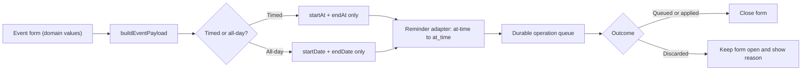
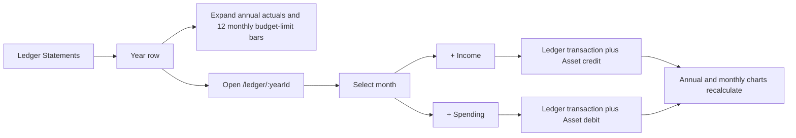

# Household Hub Mobile-First Implementation Progress

**Last updated:** 2026-07-25

**Canonical continuation file:** `progress.md`

**Implementation branch:** `codex/household-hub-mobile-first`

**Implementation worktree:** `/Users/conlegs/dev/household-hub/.worktrees/household-hub-mobile-first`
**Latest implementation checkpoint:** Web parity correction pass, Tasks 1–6
complete. Final acceptance commit is the current HEAD after
`docs: complete web parity correction handoff`.
**Last review-clean baseline:** `d1f3e30` (Tasks 1–2, independent review).
Tasks 3, 4, and 5 are complete (self-reviewed). **Task 6 is complete**
(6A–6F done). The authenticated local test household is ready. The web
UI-fidelity correction pass is also complete: Calendar, Groceries, Ledger,
Notes, Trips, and cross-feature verification all passed. Task 7 (Expo
foundation) is the next implementation task, but must not start until the user
accepts this web checkpoint.

This file is the source of truth for continuing the approved web-first
Household Hub rebuild. Current Git state and fresh verification results take
precedence if this file ever becomes stale.

## How to resume safely

1. Work from:

   ```bash
   cd /Users/conlegs/dev/household-hub/.worktrees/household-hub-mobile-first
   ```

2. Read, in order:

   - `progress.md`
   - `docs/superpowers/plans/2026-07-24-household-hub-web-first-native-parity.md`
   - `docs/superpowers/specs/2026-07-24-web-first-household-hub-redesign.md`
   - `docs/mobile-design-reference/README.md` (+ `Household Hub Mobile.dc.html`) — drives Task 5+ UI
   - `CLAUDE.md`
   - `docs/superpowers/progress-detail.md` — deep per-task history (optional)
   - `mobile/AGENTS.md` before changing Expo code

3. Reconcile the repository before editing:

   ```bash
   git status --short
   git log --oneline -12
   ```

4. Preserve the existing untracked reference/scaffold files unless the active
   task explicitly brings them into scope:

   - `DEPLOYMENT.md`
   - `docs/mobile-design-reference/`
   - `docs/mobile-implementation-handoff.md`
   - the still-untracked files under `mobile/`

5. The web parity correction plan in
   `docs/superpowers/plans/2026-07-25-web-parity-corrections.md` is complete.
   Use the seeded test household below to review the actual data-backed screens.

6. **Do not start Task 7 yet.** It remains the first Expo/mobile task, but the
   user explicitly requested the web UI correction first. Once that correction
   is accepted, read `mobile/AGENTS.md` before changing Expo code. Update
   `progress.md` at **every sub-checkpoint** (HEAD, commit, verification, resume
   point) — per the user's directive.

   **Deferred cleanup (safe, no behavior impact):** the legacy page-based
   screens/hooks/components (`src/components/pages|budget|savings|groceries|
   trips|notes`, `src/hooks/useBudget|useSavings|usePages|useTrip|useGroceries|
   useCalendar`, `src/routes/PageView|SectionListPage`, and their tests) remain
   in the tree but are **fully unrouted and unreferenced by the rebuilt route
   graph** (verified by grep from `App.tsx` through `features/`, `shell/`,
   `components/auth/`). The functional retirement requirement — rebuilt clients
   never read/write legacy `pages`/`budget_*`/`savings_*` — is met. Physically
   deleting that dead code (~15 files + tests) was deferred to avoid
   destabilizing the passing suite at the end of Task 6; do it as its own
   commit before merge or during Task 9 cleanup.

## Approved product direction

- Rebuild and validate the web application first.
- Phone web and native follow the supplied mobile design reference.
- Desktop web keeps a wider left navigation pane with the same behavior.
- Primary destinations are Calendar, Groceries, Ledger, Notes, and Trips.
- Calendar is the default destination. There is no Home destination.
- The header contains the rabbit/penguin identity, Notifications, and Settings.
- Notes retain multiple named documents.
- Web, iOS, and Android use one Supabase backend and one shared domain contract.
- Native targets portrait phones only.
- Production application data will start empty, but the production reset must
  not run until a separate release-time approval.

## Progress summary

| Task | Status | Completion |
| --- | --- | --- |
| 1. Shared foundation and domain contracts | Complete | Review-clean at `ffc3c01` |
| 2. Supabase schema and operation RPC | Complete | Review-clean at `d1f3e30` |
| 3. Identity, notifications, jobs, deployment config | Complete | Verified at `24a5b39` (self-review; no independent review agent) |
| 4. Durable web operation queue | Complete | Verified at `f86f4c0`; its UI surface lands with Task 5 |
| 5. Responsive web shell and visual system | Complete | Verified at `626c681` (self-review) |
| 6. Web feature flows | Complete | 6A–6F done; verified at `eafdce8` (self-review) |
| Pre-7. Authenticated local test setup | Complete | Verified at `c5dc6d3`; real two-member Supabase household |
| Web correction 1. Calendar contract | Complete | Timed/all-day payloads, reminder adapter, final outcome handling |
| Web correction 2. Groceries | Complete | Purchase dates, autocomplete, rename, five cheapest history |
| Web correction 3. Ledger | Complete | Annual/month charts, default income categories, separate transaction workflows |
| Web correction 4. Notes | Complete | Plain read view plus explicit draft Save/Cancel |
| Web correction 5. Trips | Complete | Manual destination currency and matching-Asset expense flow |
| Web correction 6. Final verification | Complete | Local reset, seeded reference data, browser comparison, and full automated verification |
| 7. Expo foundation and offline data layer | Pending | Not started |
| 8. Expo feature parity and visual implementation | Pending | Not started |
| 9. Reset procedure, E2E verification, release handoff | Pending | Not started |

## Web parity correction pass

Canonical design and execution documents:

- `docs/superpowers/specs/2026-07-25-web-parity-corrections-design.md`
- `docs/superpowers/plans/2026-07-25-web-parity-corrections.md`

### Correction Task 1 — Calendar operation contract (complete)

**User-visible result**

- Timed and all-day events now save through the real operation RPC.
- The **At time** reminder now persists and reloads correctly.
- A final server rejection no longer dismisses the event form. The form stays
  open and shows the server explanation, so the entered values are not hidden.
- Offline/durably queued saves still close normally because the queue has
  accepted responsibility for replay.
- Event deletion uses the same final-outcome rule.

**Root causes and corrections**

1. `buildEventPayload` sent the inactive temporal fields as explicit `null`
   values. The server validator requires one discriminated branch:
   timed events have only `startAt`/`endAt`; all-day events have only
   `startDate`/`endDate`. Payload construction now omits the inactive keys.
2. The shared UI model calls the immediate reminder `at-time`, while Supabase
   stores `at_time`. `src/features/calendar/reminders.ts` now owns the explicit
   two-way adapter; `none` is never persisted.
3. `enqueueOperation` reports a rejected/conflicted command as a resolved
   `discarded` outcome. `EventSheet` previously treated every resolved promise
   as success and closed. `src/lib/operations/outcome.ts` now turns only the
   final discarded result into a form error.



**Regression coverage**

- `src/test/calendarMutations.test.ts`: disjoint temporal payload branches and
  reminder serialization.
- `src/test/calendarReminders.test.ts`: complete supported reminder mapping,
  `none`, and unknown stored values.
- `src/test/operationOutcome.test.ts`: queued, settled, and discarded outcomes.
- `src/test/CalendarScreen.test.tsx`: discarded save stays visible; queued save
  closes.
- `src/test/calendarDatetime.test.ts`: older assertions updated from the invalid
  null-key contract to the required omitted-key contract.

**Authenticated local Supabase evidence**

- Signed in as `yongju@test.local`.
- Created a timed event, an all-day event, and a timed event with **At time**
  plus **10 min** reminders; edited the first event.
- All four RPC results were `applied`, at server sequences 24–27.
- Stored rows had the correct mutually exclusive temporal columns.
- Stored reminder rows were `at_time` and `10m`.
- Existing `invalid_payload` receipt count remained **8** and its latest
  timestamp remained `2026-07-25 22:40:01.28124+00`; this verification created
  no new invalid-payload receipt.
- The three temporary events were removed through three successful
  `calendar.event.delete` operations (server sequences 28–30), and a final
  database query returned zero matching live event rows.

**Verification at this checkpoint**

- Full Vitest: **64 files, 366 tests passed**.
- ESLint: clean.
- Production TypeScript/Vite/PWA build: clean. Vite retains the existing
  non-blocking large-chunk warning.
- Correction Task 2 continued immediately after the user removed the
  stop-after-each-task checkpoint.

### Correction Task 2 — Grocery parity workflows (complete)

- Added migration `20260725016000_grocery_purchase_dates.sql`. The database,
  not the client, assigns `checked_at` on first check, preserves it during
  checked-item edits, clears it on uncheck, and replaces it on recheck.
- Checked items sort by newest purchase first and display the local purchase
  date.
- List titles use the shared accessible `EditableTitle` component and inspect
  final operation outcomes.
- Autocomplete combines current item names and immutable price history across
  the whole household, deduped case-insensitively.
- Activating an item displays its five cheapest recorded prices, ascending,
  with the Grocery list/store and date for every entry.
- Local Supabase was reset through the new migration; all database tests passed
  (**5 files, 310 tests**) and generated database types were refreshed. The
  Yongju/Claire test household was recreated through onboarding and invite
  redemption.
- Web verification: **65 files, 376 tests passed**; ESLint, TypeScript, Vite/PWA
  build, and `git diff --check` passed. The full multi-feature live matrix
  remains scheduled for Correction Task 6.

### Correction Task 3 — Ledger annual/monthly workflows (complete)

**User-visible result**

- `/ledger` is list-first again: each Statement year has its own expandable
  annual chart control and a separate chevron into the 12-month detail route.
- `+ Year` opens a four-digit year form, rejects a duplicate locally, and uses
  a new entity UUID for a valid year.
- `/ledger/:yearId` now contains the reference-style 4×3 month picker, actual
  income/spending donut and legend, monthly budget utilization, Spent/Limit/Left
  cards, category progress, and visible Income and Spending histories.
- Income and spending have separate add buttons and fixed-category-kind forms.
  Existing transactions can be edited or deleted; deletion reverses the linked
  Asset posting.
- New years receive Salary, Bonus, RRSP, TFSA, ESPP, and Government benefit
  income categories in every month.



**Database design**

- Migration `20260725017000_ledger_default_income_categories.sql` adds one
  idempotent security-definer helper and insert triggers on years/months.
  This keeps default-category creation atomic without replacing the large
  versioned operation RPC body. Existing years are backfilled with missing
  defaults only; custom categories remain untouched.
- Database coverage verifies six category rows, 72 month-category rows, and
  six entity-revision rows for each new year.

**Authenticated operation evidence**

- Signed in as `yongju@test.local` against local Supabase and used the real
  `apply_household_operation` RPC.
- Created a CAD Asset, a 2026 year, one income transaction, and one spending
  transaction. The Asset moved from `$100.00` to `$1,800.00`.
- Edited spending from `$300.00` to `$250.00`; the Asset correctly became
  `$1,850.00`.
- Deleted both transactions; the Asset returned exactly to its `$100.00`
  opening balance.
- The year had exactly six default income categories.

**Verification at this checkpoint**

- Supabase: **5 files, 313 tests passed**.
- Web: **67 files, 384 tests passed**.
- ESLint, TypeScript, Vite/PWA build, generated database types, and
  `git diff --check` passed. The existing large-chunk warning remains
  non-blocking.

### Correction Task 4 — Notes read mode and explicit editing (complete)

- Notes now open as semantic plain content. The read renderer supports body
  paragraphs, H1–H3, bullet lists, numbered lists, nested list content,
  checked/unchecked checklist items, hard breaks, empty documents, and safely
  ignores unsupported nodes.
- Edit and title activation enter one local draft containing both title and
  document. The editor updates that draft immediately but performs no network
  autosave.
- Save sends exactly one `note.upsert`; Cancel discards every local change.
  A final discarded/conflicted Save remains open with its explanation.
- A queued Save returns to read mode using a local accepted snapshot, so offline
  users immediately see the content they just accepted into the durable queue.
- Authenticated local verification created the complete heading/bullet/
  numbered/checklist document as Yongju, read the same document as Claire, and
  then deleted it through the real operation RPC.
- Web verification: **68 files, 390 tests passed**; ESLint, TypeScript,
  Vite/PWA build, and `git diff --check` passed.

### Correction Task 5 — Trip currency and Asset workflow (complete)

- Destination setup is grouped and previewed as
  `destination · IANA timezone · ISO currency`. Currency remains fully manual,
  normalizes to uppercase while typing, and must be a real three-letter ISO
  code.
- Trip names now use the same inline editor as Grocery lists; rename commands
  preserve destination, timezone, dates, currency, and revision.
- Expense currency choices are exactly CAD plus destination currency
  (deduped). The Paid from control contains only Assets whose stored currency
  matches the selected expense currency and resets safely when currency
  changes.
- When no matching Asset exists, Save is disabled and the sheet links directly
  to `/ledger?segment=assets`; Ledger now honors that deep link.
- Trip and expense forms inspect final operation outcomes and retain entered
  values after a discarded/conflicted command.
- Authenticated local verification for a GBP Trip recorded separate totals of
  CAD `$20.00` and GBP `£70.00`. The CAD Asset moved to `$80.00`, GBP cash to
  `£430.00`, and only the CAD expense produced a linked Travel Ledger row.
  Both temporary expenses and the Trip were then removed, reversing their
  balances and the CAD Ledger effect.
- Web verification: **70 files, 398 tests passed**; ESLint, TypeScript,
  Vite/PWA build, and `git diff --check` passed.

### Correction Task 6 — Cross-feature verification and handoff (complete)

**Disposable local acceptance environment**

- Confirmed `.env.local` points to loopback Supabase at
  `http://127.0.0.1:55321` before resetting.
- Replayed every migration and ran the complete database test suite:
  **5 files, 313 tests passed**. Supabase schema lint reported no errors.
- Recreated the two-member `🐰 & 🐧 Test` household through the real onboarding
  and invitation path. The credentials in the Environment section below remain
  valid.
- Seeded 26 real `apply_household_operation` commands rather than inserting
  feature rows directly. The retained reference dataset covers:
  - a Calendar event;
  - two Grocery lists, current and checked items, purchase dates, and six price
    records for the five-cheapest-history UI;
  - CAD and GBP Assets;
  - 2026 income, spending, category limits, annual/month charts, and the
    automatically linked 2027 Travel statement;
  - a semantic checklist Note; and
  - a London Trip with separate CAD `$5,309.00` and GBP `£2,409.00` totals.

**Browser/reference review**

- Exercised authenticated routes with local system Chrome at **402×874** phone
  size and **1440×1000** desktop size.
- Captured 15 broad route screenshots and 9 light-mode focused comparisons in
  `/tmp/household-hub-web-parity/`. They are local evidence only; repository
  policy does not track generated screenshots.
- Reviewed Calendar, Grocery list/detail, Ledger year/month detail, Notes
  read view, and Trip detail. Header actions, five-tab phone navigation,
  desktop left pane, cards, segmented controls, charts, scrolling, and
  fixed-bottom spacing match the approved visual system.
- Browser instrumentation reported **zero page errors and zero console errors**.
- Disabled Recharts animation for the statement donut so the complete chart is
  present immediately and deterministic in both screenshots and first paint.

**Behavioral and automated acceptance**

- Tasks 1–5 each used the real versioned operation RPC for their authenticated
  mutation matrix. That evidence includes Calendar temporal/reminder storage,
  Grocery purchase/history behavior, atomic Ledger/Asset reversal, partner
  Notes visibility, and CAD-versus-foreign Trip posting rules.
- The durable queue suite covers offline create/edit/delete, persistent FIFO
  replay, reconnect, duplicate receipts, stale-revision conflicts, permanent
  discard explanations, two-device ordering, optimistic overlays, and Realtime
  reconciliation.
- Final web verification: **70 files, 398 tests passed**; ESLint, TypeScript,
  Vite/PWA production build, and `git diff --check` passed.
- Final backend verification: **5 database files, 313 tests passed**;
  `supabase db lint --local` clean. Edge Function tests remain **73 passed**.
- The existing Vite large-chunk warning is non-blocking. No hosted deployment,
  production reset, native build, or physical-device action was performed.
- Itinerary, Bookings, and Checklist remain explicit future Trip schema work;
  Expenses is the fully implemented fourth Trip tab in this correction scope.

**Correction commits**

| Task | Commit |
| --- | --- |
| Calendar contract | `b7a33b7 fix: align Calendar operation contract` |
| Groceries parity | `876d532 feat: restore Grocery parity workflows` |
| Ledger workflows | `9523b77 feat: complete Ledger statement workflows` |
| Notes read/edit modes | `bfd8d5d feat: add Notes read and explicit edit modes` |
| Trip currency workflow | `2b18d9e feat: clarify Trip currency expense flow` |
| Final handoff | `docs: complete web parity correction handoff` (current HEAD) |

**Next gate:** review the seeded web app, then explicitly approve Task 7 before
any Expo implementation begins.


## Task 6 — web feature flows (complete)

Fills the placeholder routes with real, tested flows on top of the durable
operation queue (Task 4) and shell (Task 5). Sub-checkpoints (each TDD →
implement → affected suite → commit → this file):

- **6A — Calendar (done).** `src/features/calendar/`: pure `monthGrid.ts`
  (6×7 Sunday-first grid, span/shift helpers) and `events.ts` (recurrence +
  multiday expansion, device-timezone placement via the domain's
  `calendarDateInTimeZone`); `datetime.ts` wall-clock↔UTC for the event
  timezone; `useCalendarEvents` (household-scoped read, reminders joined);
  `mutations.ts` (`calendar.event.upsert`/`delete` payload builder + enqueue);
  `EventSheet` (timed/all-day/multiday, recurrence, reminder presets, owner,
  delete-confirm) and `CalendarScreen` (month grid with event dots,
  selected-day list, `?event=<id>` notification deep link). Route wired in
  `src/App.tsx`. `src/features/household.ts` shared household accessor.
  **Verification:** `npx vitest run` **308 passed** (48 files; +29 vs Task 5),
  lint clean, build clean.
- **6B — Groceries (done).** `src/features/groceries/`: `data.ts` (list index
  + list detail reads with price history joined; `latestPriceByName`,
  `normalizeItemName`); `mutations.ts` (list/item upsert+delete, toggle-checked,
  clear-checked = one delete command per checked item); `GroceriesScreen`
  (list index + create-list sheet), `GroceryListScreen` (add-item row with CAD
  price, unchecked/checked split, per-item edit `ItemSheet`, price recall from
  history, clear-checked + delete-list confirms), routes `/groceries` and
  `/groceries/:listId`. Shared `src/features/moneyInput.ts`
  (`parseDollarsToCents`/`centsToInputValue`, integer-cents boundary, reused by
  Ledger/Trips). **Verification:** `npx vitest run` **324 passed** (51 files;
  +16), lint clean, build clean.
- **6C-1 — Ledger Assets segment (done).** `src/features/ledger/`: `assets.ts`
  (reads from the `ledger_asset_balances` view; transfers + schedules reads;
  `totalsByCurrency`/`householdTotalCents` — CAD is the household total, foreign
  currencies shown separately and never converted); `assetMutations.ts`
  (asset/transfer/schedule upsert+delete, `toggleSchedule`, balance is the
  *desired* balance the server reconciles); `AssetSheet` (name/kind/currency/
  balance; currency locked once the asset exists), `TransferSheet` +
  `ScheduleSheet` (weekly/biweekly/semi_monthly/monthly), `AssetsTab` (total
  header + foreign subtotals, asset cards, transfers, recurring with
  active-toggle + delete confirms). `LedgerScreen` shell with Statements/Assets
  `SegmentedControl`; route `/ledger`. `StatementsTab` is a temporary
  placeholder until 6C-2. **Verification:** `npx vitest run` **330 passed**
  (53 files; +6), lint clean, build clean.
- **6C-2 — Ledger Statements segment (done, committed `2ebd49b`).**
  `src/features/ledger/statements.ts` (`useLedgerYears`/`useLedgerYearData`
  reads across months/month-categories/limits/transactions; `monthSummaries`
  income/spending/net per month; `categoryProgress` spend-vs-limit ratio per
  category; `hasSpendingFromMonth` deletion-guard helper); `statementMutations.ts`
  (`createYear`/`clearYear`/`saveCategory`/`deleteCategory`/`saveLimit`/
  `saveTransaction`/`deleteTransaction`, matching the RPC's `ledger.year.*`/
  `ledger.category.*`/`ledger.limit.*`/`ledger.transaction.*` command types in
  `supabase/migrations/20260725011000_household_operation_rpc.sql`);
  `TransactionSheet`, `CategorySheet` (name/kind/limit, fromMonth→December
  propagation), `ClearYearSheet` (typed-year confirmation); `StatementsTab`
  replaces the 6C-1 placeholder with year picker + create-year, 4×3 month
  picker with per-month net, category list with limit progress bars, and
  clear-year. **Verification:** `npx vitest run` **334 passed** (54 files;
  +4), lint clean, build clean. Not independently reviewed (session
  directive: no subagents).
- **6D — Notes (done, committed `787eca3`).** `src/features/notes/`:
  `data.ts` (`useNotes` list, `useNote` detail reads against
  `household_notes`; `emptyNoteDocument`); `mutations.ts` (`saveNote`/
  `deleteNote` via `note.upsert`/`note.delete`, matching the RPC's
  `mobile_note_node_valid` payload shape); `RestrictedEditor.tsx` — Tiptap
  restricted to StarterKit with bold/italic/strike/code/codeBlock/blockquote/
  horizontalRule/link/underline/dropcursor/gapcursor disabled, heading levels
  capped to 1-3, plus `TaskList`/`TaskItem`, so every producible document
  satisfies the shared `isRichNoteJson` validator (`packages/domain/src/
  notes.ts`) that native TenTap must also satisfy; own `editor.css` using
  `--hh-*` tokens (kept separate from the legacy `src/components/notes/
  editor.css`, which still styles the unrestricted legacy Tiptap editor).
  `NotesScreen` (list + create), `NoteScreen` (title input saved on blur,
  document saved via the editor's debounced `onChange`, delete-confirm) at
  routes `/notes` and `/notes/:noteId`, replacing the Task 5 placeholder.
  Title and document edits share one locally-tracked revision (advanced by
  one per successful save, matching the RPC's `current_revision + 1`) so a
  title edit and a document edit moments apart each get a fresh base
  revision without waiting on a refetch. **Verification:** `npx vitest run`
  **342 passed** (57 files; +8), lint clean, build clean. Not independently
  reviewed (session directive: no subagents). The sessionless bypass used at
  that historical checkpoint has since been removed; authenticated local
  feature testing is now available through the test household below.
- **6E — Trips (done).** `src/features/trips/`: `data.ts` (`useTrips` list,
  `useTrip` detail with expenses; `expenseBuckets` delegates to the domain's
  `aggregateTripCurrencyBuckets` — CAD and destination-currency totals stay
  separate and are never converted); `mutations.ts` (`saveTrip`/`deleteTrip`
  via `trip.upsert`/`trip.delete`; `saveExpense`/`deleteExpense` via
  `trip.expense.upsert`/`trip.expense.delete` — a CAD expense is server-linked
  into the Ledger + debits the asset, a foreign expense debits only);
  `TripSheet` (name/destination/dates/timezone/currency), `ExpenseSheet`
  (amount/currency choice of destination or CAD/asset/date), `TripsScreen`
  (list + create) and `TripScreen` (header + Itinerary/Bookings/Checklist/
  Expenses tab bar; **Expenses fully functional** with per-currency buckets).
  Routes `/trips` and `/trips/:tripId`. **Scope note:** the mobile-first schema
  (Task 2) only defines `household_trips` + `trip_expenses` and the RPC only
  supports `trip.*`/`trip.expense.*` — the Itinerary/Bookings/Checklist tables
  are legacy page-based (`page_id`, no mobile-first operations), so those three
  tabs render an honest "coming soon" state. Wiring them needs new mobile-first
  content tables + operations (a schema follow-up, not part of the current
  durable-queue contract). **Verification:** `npx vitest run` **348 passed**
  (59 files; +6), lint clean, build clean. Not independently reviewed (session
  directive: no subagents).
- **6F — Settings + legacy retirement (done).** `src/features/settings/`:
  `profile.ts` (`useProfile` reads the signed-in user's `profiles` row;
  `saveProfileSettings` persists displayName/appearance/notificationsEnabled via
  the `settings.update` durable operation, entityId = user id per the RPC's
  `entity_id = actor_id` rule); `household.ts` (`useHouseholdMembers` with roles
  + `owner_user_id`, `useHouseholdInvites` pending list; admin RPC wrappers
  `createInvite`/`revokeInvite`/`transferOwnership`/`removeMember`/
  `deleteHousehold`/`prepareAccountDeletion`, each normalized to the domain's
  `HouseholdAdminResult`); `DangerConfirm` (typed-phrase destructive gate);
  `SettingsScreen` replaces the Task-5 `src/screens/SettingsScreen.tsx`
  (removed) with Profile (name + notifications), Appearance (local + synced via
  settings.update), Household (members/roles, invite create+revoke shown only
  when there's no partner, transfer-ownership + remove-member shown to the owner
  with a partner), Account (email + sign out), and a Danger zone (delete
  household / delete account, both typed-confirmed). Route rewired in
  `src/App.tsx`. **Legacy retirement:** the rebuilt route graph (App → features/
  shell/ components/auth) is verified free of legacy `pages`/`budget_*`/
  `savings_*`/page-template hook imports; the dead legacy code physically
  remains in-tree (unrouted, unreferenced) with deletion deferred as a safe
  standalone cleanup (see "How to resume safely" §6). **Verification:**
  `npx vitest run` **353 passed** (60 files; +5), lint clean, build clean. Not
  independently reviewed (session directive: no subagents). **Task 6 complete;
  next is Task 7 (Expo).**

## Task 5 — responsive web shell + visual system (complete)

Built beside the legacy Swiss theme; legacy page screens stay **unrouted** in
the tree until Task 6 retires them. Sub-checkpoints (each committed + verified):

- **d452fa3** — `src/styles/theme.css` semantic `--hh-*` tokens (design
  reference: canvas `#EFEFF2`, ink `#14151A`, accent `#FF7A45`, data palette,
  card radii/shadows) + light/system-dark/forced-dark; `src/lib/appearance.ts`
  Light/Dark/System (`data-appearance` on `<html>`, persisted, applied on boot).
- **37b60dc** — `src/shell/AppShell.tsx`: persistent header (rabbit/penguin
  mark + Notifications/Settings header icons), phone floating 5-tab bar,
  desktop left pane; Heroicons. Routes `/calendar` (default; `/` and unknown →
  redirect), `/groceries`, `/ledger`, `/notes`, `/trips`, `/notifications`,
  `/settings`. Placeholder screens; Settings is real (appearance/account/sign
  out).
- **626c681** — `src/shell/ui/`: `Card`, `SegmentedControl`, `BottomSheet`,
  destructive `ConfirmDialog` (Radix), `Loading/Empty/Error` states, and
  `SyncStatus` (surfaces the Task 4 queue: pending pill + per-discard conflict
  cards via `explainDiscard`).

**Verification at `626c681`** (arm64 node): `npx vitest run` 44 files /
**279 passed**; `npm run lint` clean; `npm run build` clean. Responsive is via
Tailwind `md:` breakpoints; visual/responsive **screenshot** tests are deferred
to Task 9's Playwright setup (per the plan). Not independently reviewed
(session directive: no subagents); `/code-review` remains the pre-merge
follow-up.

## Environment, constraints & risks (condensed)

- **Local sign-in is enabled and required.** `RequireAuth` no longer recognizes
  `VITE_DISABLE_AUTH`; every protected route requires a real Supabase session.
  The ignored `.env.local` has `VITE_ENABLE_TEST_AUTH=true`, which exposes the
  email/password form only in the local/test build. Production authentication
  remains Google and Apple OAuth only.
- **Local test household:** `🐰 & 🐧 Test`, provisioned through the real
  `onboard_household` + invite-redemption path with Yongju as owner and Claire
  as member.

  | Member | Email | Password | Role |
  | --- | --- | --- | --- |
  | Yongju | `yongju@test.local` | `household123` | Owner |
  | Claire | `claire@test.local` | `household123` | Member |

  Start the local stack and app with:

  ```bash
  PATH="/opt/homebrew/bin:$PATH" npx supabase start
  PATH="/opt/homebrew/bin:$PATH" npm run dev
  ```

  Sign in manually with either account. Browser sessions persist normally, and
  every record entered through the app persists in local Supabase across Vite
  restarts. Re-running `scripts/seed-household.ts` with the same household and
  credentials is idempotent: it reuses the accounts and membership without
  clearing or replacing feature data.
- **No separate demo mode exists.** The abandoned automatic-login/sample-data
  design and implementation plan were removed in `c5dc6d3`; `npm run demo` was
  never implemented.
- **Browser verification at `c5dc6d3`:** an unauthenticated `/calendar` visit
  redirected to `/login`; Yongju signed in and saw the two-member household
  with owner controls; sign-out returned to `/login`; Claire signed in and saw
  the same roster without owner-only controls.
- **Verification at `c5dc6d3`:** Vitest **354 passed** across 61 files; ESLint
  clean; TypeScript + Vite production build clean; `git diff --check` clean.
  The build retains the existing non-blocking large-chunk warning.
- **Run from this worktree** (`codex/household-hub-mobile-first`), not the main
  checkout — different branch.
- **Prefix Node commands with `PATH="/opt/homebrew/bin:$PATH"`** — the Rosetta
  x64 node breaks `npm test`/`build` (arch mismatch); arm64 runs clean. Supabase
  CLI must be ≥ 2.109.
- **Migrations go to both DBs separately:** `supabase db push` (cloud) and
  `supabase db reset` / `migration up` (local).
- **Nothing is deployed** — all verification is local; no hosted Supabase,
  Vercel, or EAS build touched. Production data untouched. **Do not run the
  production reset** (Task 9; needs explicit release approval).
- **No independent review agent ran for Tasks 3–4** (session directive: no
  subagents) — self-review + live end-to-end only. `/code-review` on this branch
  is the recommended pre-merge follow-up.
- **Legacy membership preflight:** the one-user/one-household unique constraint
  fails if legacy data has a user in multiple households — resolve before a
  hosted deploy.
- Carried-forward risks (permanently-failing push batch, Expo push not yet
  exercised against Expo's servers, live two-client Realtime) are in the archive.

## Full detail

Architecture diagrams, per-task narratives, per-task verification baselines,
reviews, and the original task scope now live in
`docs/superpowers/progress-detail.md`. Current git state + fresh verification
always take precedence over both files.
